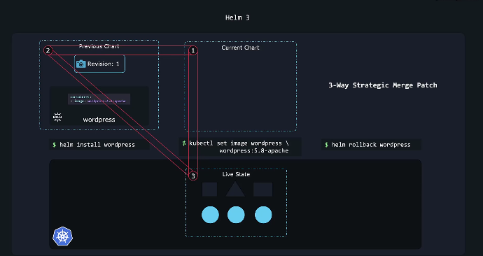
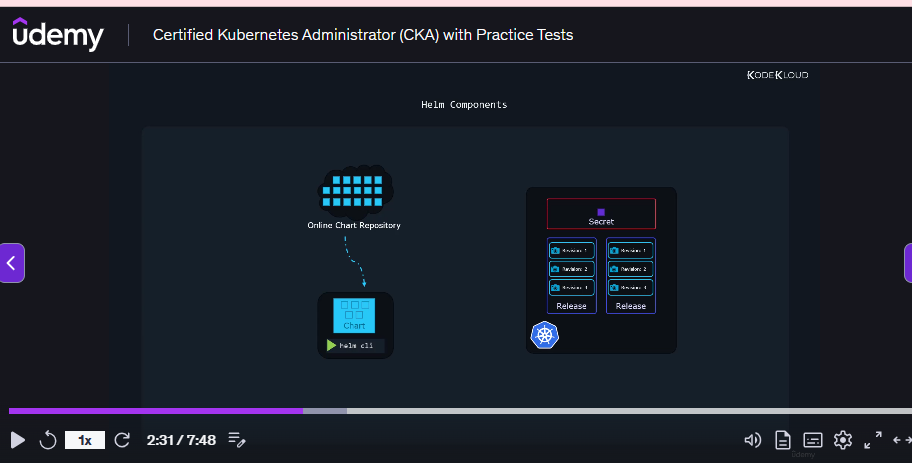

# HELM

Now, Kubernetes is awesome at managing complex infrastructures.

# A typical app is usually made up of a collection of objects that need to interconnect to make everything work.

For example, even a relatively simple WordPress site might need the following,

a deployment to deploy the pods that you wanna run,

such as MySQL database servers or web servers,

a persistent volume to store the database,

a persistent volume claim,

a service to expose the web server running in a pod to the internet,
a secret to store credentials like admin passwords and other things,

and maybe even more if you want extra stuff like periodic backups, jobs and so on.

# For every object, we might need a separate YAML file. Then we need to apply kubectl apply on every YAML file to get these objects created,

# and this can be a tedious task, but that's not the end of it.

Now imagine we download these YAML files from the internet and we are not happy with the default,

so we start changing stuff. The persistent volumes are 20 GB, but we know our website will need much more storage than that,

so we go to the YAML files where the PVs and PVCs are declared, and we change 20 to 100.

More stuff needs to be changed. Well, we'll have to open up every YAML file and edit each one according to our needs. And now, not bad enough yet,

imagine two months go by

and we now have to upgrade some components in our app,

and so we are back

to editing multiple YAML files' declarations again,

with great care

so that we don't change the wrong thing in the wrong place.

Now, sometime later, you wanna delete the app

and we'll need to remember each object

that belongs to our app and delete them all one by one.

Now you might be thinking, Hey, that's not a big deal.

We can just write all object declarations

in a single YAML file and be done with it.

Well, that's true,

but it might make it even harder to find stuff

when you're looking for,

say you wanna troubleshoot an issue,

we'd have to continuously search for stuff

that we need to edit in something

that could be 25 pages of text.

Now, at least in multiple files,

they'd be somewhat organized

and we'd know we'll find deployment related stuff

in the mydeployment.yaml file, for example.

# HELM 
Enter Helm, Helm changes the paradigm.

Kubernetes doesn't really care about our app as a whole.
All that it knows is that we declared various objects

and it proceeds to make each of them exist in our cluster.

It doesn't really know that this persistent volume

and that deployment and that secret

and that service are all part

of a big application called WordPress.

It looks at all the little pieces

that the administrator wanted to have in the cluster

and takes care of each one individually.

Helm, however, is built from ground up

to know about such stuff.

That's why it's sometimes called a package manager

for Kubernetes.

It looks at those objects

as part of a big package as a group,

and whenever we need to perform an action,

we don't tell Helm the objects that it should touch,

we just tell it what package we want to act on,

like our WordPress app package.

And based on the package name,

it then knows what objects it should change and how,

even if there are hundreds of objects

that belong to that particular package.

Now, to make this easier to understand, think about this,

a computer game is contained

in hundreds of thousands of files.

There are a few files with the program's executable code,

other files with audio, game sounds and music,

and other files with graphics, textures, images,

files with configuration data and so on.

Now, imagine we'd have to download each of them separately,

and that would be tedious.

Fortunately, we don't have to go through such horrors

as we get a game installer.

We run it, we choose the directory where we want to install,

we press the install button,

and then the installer does the rest,

putting thousands of files in their proper location.

# Helm does a similar thing and more for YAML files and the Kubernetes objects that make up our application.

We use a single command to install our entire app, even if it needs hundreds of objects,

Helm proceeds to automatically add every necessary object to Kubernetes without bothering us with the details.

We can customize the settings we want for our app or package by specifying desired values at installed time,

but instead of having to edit multiple values

in the multiple YAML files, we have a single location

where we can declare every custom setting.

In a file like values.yaml,

we can change the size of our persistent volumes,

choose the name of our WordPress website,

the admin password, settings for the database engine, and so on.

# We can upgrade our application with a single command. Helm will know what individual objects need to change to make this happen.

# Helm keeps track of all the changes made to the app files, and that allows us to roll back to the previous so-called revision.

# We use a single command to uninstall our app, and it keeps track of all the objects used by each app

# so it knows what to remove. We don't need to remember each object that belongs to one of our apps anymore or use 10 separate commands to remove everything.

**Helm does all the work.
**

# For now, understand that Helm works as a package manager with Install or Uninstall Wizard, and also as a release manager helping us upgrade or rollback applications.

# The most important thing is that it lets us treat our Kubernetes apps as apps instead of just a collection of objects, and this takes a huge burden off our shoulders

# as we don't have to micromanage each Kubernetes object anymore.

# Helm can do that for us.

-----------------------------------------------------------------------
------------------------------------------------------------------
# Installation and Configuration 
And before installing Helm,

you must first have a **functional Kubernetes cluster** and **kubectl installed** and configured on your local computer with the right **login details set up the kubeconfig file** to work with the intended Kubernetes cluster.

System with Snap can install Helm using the **snap install helm command**.

**Use the classic option** to install a more relaxed sandbox that gives the app a bit more access to the whole system.So rather than strictly isolating it to its separate environment,

this way, Helm can easily access the kubeconfig file in your home directory so it knows how to connect to our Kubernetes cluster.

For **APT bases systems, such as the BN or Ubuntu**, follow the instructions to add key and sources list before installing Helm.

And for **PKG**, I'll run the pkg install helm command.

Now, all this refer to the latest instructions from the documentation pages to install Helm for your version of operating system.

Well, that's all for now. Head over to the labs and practice working with installing Helm on our lab environment.
---------------------------------------------------------
--------------------------------------------
# Slide Quick Note on Helm2 and Helm3

# when Helm 3 was released compared to Helm 2. And when you browse through charts and blogs online, you may come across either of these versions. So, it is important to understand the differences between them.

Now, let's look at a brief history of Helm.

# Helm 1.0 was first released in February, 2016,

# Helm 2.0 in November, 2016, and Helm 3.0 in November, 2019.

# Now, since the initial launch in 2016,

# the project has matured, and it got better and better.

The improvements were also made possible by the fact

that Kubernetes itself was improving,

# so Helm had more tools at its disposal it could leverage right off of Kubernetes.

In our lessons, we'll use Helm 3, which has a simpler and better design than the previous Helm 2 and is also a bit smarter.

# Since Helm 2 was around for a few years, a lot of users had already been using it, but there are several important changes made when Helm 3 was launched.

So, let's take a look at the differences between them.

# Helm has a CLI client installed on your local machine that helps you perform Helm-specific actions against your Kubernetes cluster.

# When Helm 2 was around, Kubernetes lacked features

**1. such as role-based access control**

**2.  custom resource definitions.**

To allow Helm to do its magic, an extra component called Tiller had to be installed in the Kubernetes cluster.

# So, whenever you wanted to perform a Helm specific operation, your Helm client communicated with Tiller that was running on some server.

# Tiller, in turn, communicated with Kubernetes and proceeded to take actions to make whatever you requested happen. So, Tiller was the middleman, so to speak. Besides the fact that an extra component sitting between you and Kubernetes adds complexity,there were also some security concerns.

# By default, Tiller was running in God mode or otherwise said, it had the privileges to do anything that it wanted.

# This was good since it allowed it to make whatever changes necessary in your Kubernetes cluster to install your charts, but this was bad since it allowed any user with Tiller, access to do whatever they wanted in the cluster.

After cool stuff like role-based access control and custom resource definitions appeared in Kubernetes,

the need for Tiller decreased,

# so it was removed entirely in Helm 3. Now, there's nothing sitting between Helm and the cluster.

**Furthermore, with RBAC, security is much improved and any user can be limited in what they can do with Helm.
**
# And before, you had to set these limits in Tiller and that was not the best option,

# but with RBAC built from ground up to fine-tune user permissions in Kubernetes, it's now straightforward to do.

**As far as Kubernetes is concerned, it doesn't matter if the user is trying to make changes within the cluster with kubectl

or with Helm commands, the user requesting the changes has the same RBAC-allowed permissions, whatever tool they use.
**
So, that's a big difference between Helm 2 and 3.

**Helm 2 had Tiller and Helm 3 simplifies integration
**
with Kubernetes by removing Tiller.

The next big difference is a three-way strategic Merge Patch. The name might sound intimidating, but don't worry.

At the end of this section,

we'll see it's actually a simple

but very smart thing that can prove quite useful.

Now, Helm has something like a snapshot feature.

Here's an example.

You can use a chart

to install a full-blown WordPress website.

This will create revision number 1 for this install.

Then if you change something, for example,

you upgrade to a newer chart

to upgrade your WordPress install,

you will arrive at revision number 2.

These revisions can be considered something like snapshots,

the exact stage of a Kubernetes package

at that moment in time.

If there's a need, you can return

to revision number 1 through a rollback.

This would get your package app to the same state it was

when you first installed your chart.

New revisions are created

whenever important changes are done with the Helm command.

For example, when we first install a package,

a revision 1 is created.

Then when we upgrade that package, a new revision appears,

that's revision 2 in this case.

And even when we roll back,

a new revision is created, revision 3.

So, that's pretty straightforward.

Helm 2 was less sophisticated

when it came to how it did such rollbacks.

And when a rollback command is issued,

Helm compares the current chart,

which is the chart that has the WordPress image 5.8 in it

with the previous chart,

which is the chart that has a WordPress 4.8 image in it

and realizes that they're different.

So, it applies the original chart

to revert the WordPress image to 4.8.

Now, let's look at another example.

Say we install a WordPress deployment using a Helm chart,

which creates revision 1 just like before.

Then a user manually goes in

and updates the application image

using the kubectl set image command.

So, the application gets updated

and this is done instead of doing the upgrade through Helm.

And this does not create a new revision in Helm,

because the change was not performed through Helm.

When we now roll back, what happens?

As before, Helm compares the current revision

with the previous version.

Since there is only one revision,

Helm does not detect any changes,

and so it does not roll back

or make any changes to the deployment.

So, Helm 2 compares the current chart

with the previous chart to identify the difference

between revisions to make a rollback decision.

And in this case, it doesn't help us,

because the manual change that the user made

is still active.

Helm 3, on the other hand, is more intelligent.

It compares the chart currently in use,

if we had created a revision that is, which we didn't.

The chart we want to revert to,

and also the live state, how our Kubernetes objects

currently look like their declarations in the yaml form,

this is where that fancy three-way

Strategic Merge Patch name comes from.

By also looking at the live state,

it notices that the image version in live is 5.8,

but the image in revision 1

that we want to revert to, it has 4.8.

So, it makes necessary changes to come back

to the original state.

Now, besides rollbacks, there are also things like upgrades

to consider, where Helm 2 was also lacking.

For example, say you install a chart,

but then you make some changes to some

of the Kubernetes objects installed.

It all works nicely until you perform an upgrade.

Helm 2 looks at the old chart

and then the new chart that you want to upgrade to,

and all your changes will be lost since they don't exist

in the old chart or the new chart.

But Helm 3, as mentioned, looks at the charts

and also at the live state,

and it notices that you added some stuff of your own,

so it performs the upgrade

while preserving the anything that you might have added.

Well, that's all for this lecture

and I
------------------------------------

# Slide#3 HELM Components

## So we have the Helm command line utility on our local system that we will be using to perform Helm actionssuch as installing a chart, upgrading, rollback, et cetera.

**Charts are a collection of files, and they contain all the instructions that Helm needs to know to be able to create the collection of objects that you need in your Kubernetes cluster.
**
**By using charts and adding the objects according to these specific instructions in the charts, Helm, in a way, installs applications into your cluster.
**
# When a chart is applied to your cluster, a release is created. A release is a single installation of an application using a Helm chart.

## Within each release, you can have multiple revisions, and each revision is like a snapshot of the application.Every time a change is made to the applications, such as an upgrade of the image or change of replicas or configuration objects, a new revision is created.

Now, just like how we can find all kinds of images on Docker hub or Vagrant boxes on the Vagrant Cloud,

if you're familiar with that, you know, we can find Helm charts in a public repository. We can easily download publicly available charts
for various applications, and these are readily available and we can use them to deploy applications on our cluster.

# And finally, to keep track of what it did in our cluster,such as the releases that it installed, the charts used, revision states and so on, Helm will need a place to save this data. This data is known as metadata, and that is data about data.

Now, it wouldn't be too useful if Helm would save this on our local computer.

If another person would need to work with our releasesthrough Helm, they would need a copy of this data.

**So instead, Helm does the smart thing and saves this metadata directly in our Kubernetes clusteras Kubernetes secrets.This way, the data survives,and as long as the Kubernetes cluster survives and everyone from our team can access it, so they can do Helm upgradesor whatever it is that they want to do.**

# So Helm will always know about everything it did in this cluster and will be able to keep track of every action, every step of the way, since it always has its metadata available.

