# Kubernetes
## Kubernetes, also known as K8's, was built by Google based on their experience running containers in production.
## It is now an open source project and is arguably one of the best and most popular container orchestration technologies out there.

# Kubernetes at high level

We must first understand two things container and orchestration. Once we get familiarized with both of these terms, we would be in a position to understand what Kubernetes
is capable of

### We're now going to look at what containers are.

We're going to start by looking at a high level overview on why you need Docker, and what it can do for you.

Let me start by sharing how I got introduced to Docker in one of my previous projects.

I had this requirement to set up an end to end application stack, including various different technologies

like a web server using Node.js and a database such as MongoDB, and a messaging system like Redis,

and an orchestration tool like Ansible.

# We had a lot of issues developing this application stack with all these different components.

First of all, their compatibility with the underlying OS was an issue.

We had to ensure that all these different services were compatible with the version of OS we were planning

to use.

There have been times when certain versions of these services were not compatible with the OS, and

we've had to go back and look at different OS that was compatible with all of these different services.

Secondly, we had to check the compatibility between these services and the libraries and dependencies

on the OS.

We've had issues where one service requires one version of a dependent library, whereas another service

requires another version.

The architecture of our application changed over time.

We've had to upgrade to newer versions of these components or change the database, etc. and every time

something changed, we had to go through this same process of checking compatibility between these various

components and the underlying infrastructure.

This compatibility matrix issue is usually referred to as the matrix from hell.

# Next, every time we had a new developer on board, we found it really difficult to set up a new environment.

The new developers had to follow a large set of instructions and that run hundreds of commands to finally

set up their environments.

They had to make sure they were using the right operating system, the right versions of each of these

components, and each developer had to set all that up by himself each time.

We also had different development, test, and production environments.

# One developer may be comfortable using one OS, and the others may be comfortable using another one,

and so we couldn't guarantee that the application that we were building would run the same way in different

environments.

And so all of this made our life in developing, building and shipping the application really difficult.

So I needed something that could help us with the compatibility issue, and something that will allow

us to modify or change these components without affecting the other components, and even modify the

underlying operating systems as required.

## And that search landed me on Docker with Docker.

I was able to run each component in a separate container, with its own dependencies and its own libraries,

all on the same VM and the OS, but within separate environments or containers.

We just had to build the Docker configuration once, and all.

Our developers could now get started with a simple docker run command, irrespective of what the underlying

operating system they run.

All they needed to do was to make sure they had Docker installed on their systems.

# What are containers

## Containers are completely isolated environments. As in they can have their own processes or services, their own network interfaces, their own mounts,
just like virtual machines, except they all share the same OS kernel. 

We will look at what that means in a bit, but it's also important to note that containers are not new

with Docker.
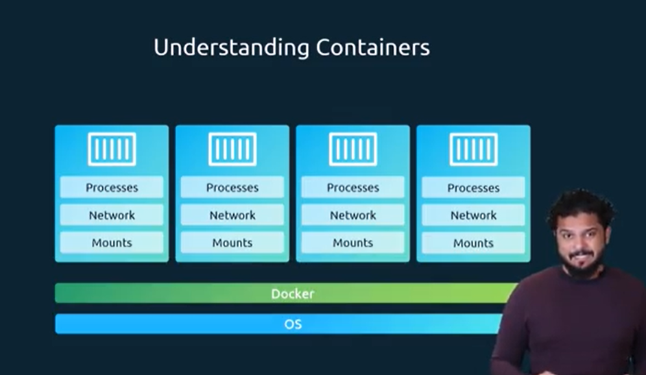

Containers have existed for about ten years now, and some of the different types of containers are

LXC, LXD, Lcfs, etc..

Docker utilizes LXC containers.

Setting up these container environments is hard as they are very low level, and that is where Docker

offers a high level tool with several powerful functionalities, making it really easy for end users

like us to understand how Docker works, let us revisit some basic concepts of operating systems first.
first.

If you look at operating systems like ubuntu, fedora, Susi, or CentOS, they all consist of two things

an OS kernel and a set of software.

The OS kernel is responsible for interacting with the underlying hardware, while the OS kernel remains

the same, which is Linux.

In this case, it's the software above it that makes these operating systems different.

This software may consist of a different user interface drivers, compilers, file managers, developer tools, etc. so you have a common Linux kernel shared across all OSes and some custom software that differentiate operating systems from each other.

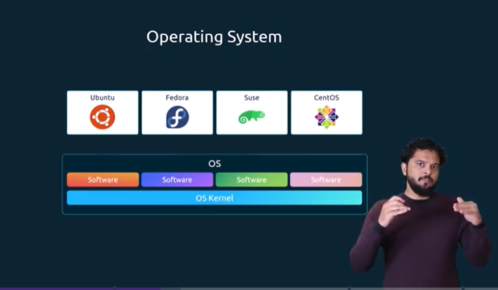

We said earlier that Docker containers share the underlying kernel. So what does that actually mean?

Sharing the kernel.
Let's say we have a system with an ubuntu OS.

With Docker installed on it.

Docker can run any flavor of OS on top of it, as long as they are all based on the same kernel.

In this case, Linux.

If the underlying OS is ubuntu.

Docker can run a container based on another distribution like Debian, fedora, Susi or CentOS.

Each Docker container only has the additional software that we just talked about in the previous slide

that makes these operating systems different.

And Docker utilizes the underlying kernel of the Docker host which works with all OSS above.

So what is an OS that do not share the same kernel as this windows?

And so you won't be able to run a windows based container on a Docker host with Linux on it.

For that you will require a Docker on a windows server.
Now it is when I say this that most of my students go, hey, hold on there.

That's not true.

And they install Docker on windows, run a container based on Linux and go see it's possible.

Well, when you install Docker on Windows and run a Linux container on windows, you're not really running

a Linux container on windows.

Windows runs a Linux container on a Linux virtual machine under the hood.

So it's really Linux container on Linux, virtual machine on Windows.

We discussed more about this on the Docker on Windows or Mac later during this course.

Now you might ask, isn't that a disadvantage then not being able to run another kernel on the OS?

The answer is no, because unlike hypervisors, Docker is not meant to virtualize and run different

operating systems and kernels on the same hardware.

## The main purpose of Docker is to package and containerize Various applications and to ship them and

to run them anywhere, anytime, as many times as you want.

So that brings us to the differences between virtual machines and containers, something that we tend

to do, especially those from a virtualization background.

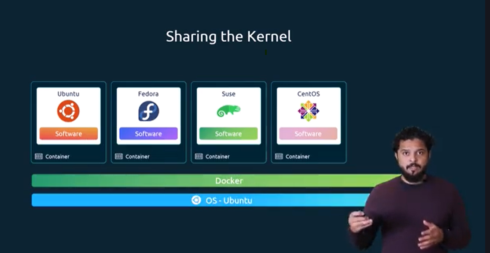

So that brings us to the differences between virtual machines and containers, something that we tend

to do, especially those from a virtualization background.
As you can see on the right, in case of Docker, we have the underlying hardware infrastructure and

then the OS and then Docker installed on the OS.

Docker then manages the containers that run with libraries and dependencies alone.

In case of virtual machines, we have the hypervisor like ESX on the hardware and then the virtual machines

on them.

As you can see, each virtual machine has its own OS inside it, and then the dependencies and then

the application.

The overhead causes higher utilization of underlying resources, as there are multiple virtual operating

systems and kernels, running the virtual machines also consume higher disk space, as each VM is heavy

and is usually in gigabytes in size, whereas Docker containers are lightweight and are usually in megabytes

in size.

This allows Docker containers to boot up faster, usually in a matter of seconds, whereas VMs, as

we know, takes minutes to boot up as it needs to boot up the entire operating system.

It is also important to note that Docker has less isolation as more resources are shared between the

containers, like the kernel, whereas VMs have complete isolation from each other since VMs don't rely

on the underlying OS or kernel.

You can run different types of applications built on different OSes, such as Linux based or windows

based apps on the same hypervisor.

So those are some differences between the two.

Now, having said that, it's not an either container or virtual machine situation.

It's containers and virtual machines.
It's containers and virtual machines.

Now when you have large environments with thousands of application containers running on thousands of

Docker hosts, you will often see containers provisioned on virtual Docker hosts.

That way, we can utilize the advantages of both technologies.

We can use the benefits of virtualization to easily provision or decommission Docker hosts as required.

At the same time, make use of the benefits of Docker to easily provision applications and quickly scale

them as required.

But remember that in this case, we will not be provisioning that many virtual machines as we used to

before, because earlier we provisioned a virtual machine for each application.

Now you might provision a virtual machine for hundreds or thousands of containers

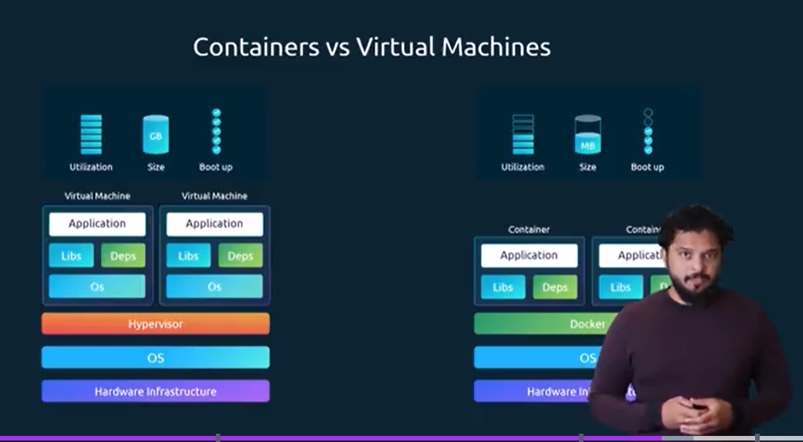

So how is it done?

There are lots of containerized versions of applications readily available as of today.

So most organizations have their products containerized and available in a public Docker repository

called Docker Hub or Docker Store.

For example, you can find images of most common operating systems, Databases and other services and

tools.

Once you identify the images you need and you install Docker on your host, bringing up an application

is as easy as running a docker run command with the name of the image.

In this case, running a docker run ansible command will run an instance of Ansible on the Docker host.

Similarly, run an instance of MongoDB, Redis, and Node.js using the docker run command.

If you need to run multiple instances of the web service, simply add as many instances as you need

and configure a load balancer of some kind in the front.

In case one of the instances were to fail, simply destroy that instance and launch a new one.

There are other solutions available for handling such cases that we will look at later during this course,

and for now, don't focus too much on the commands.

We will get to that in a bit.
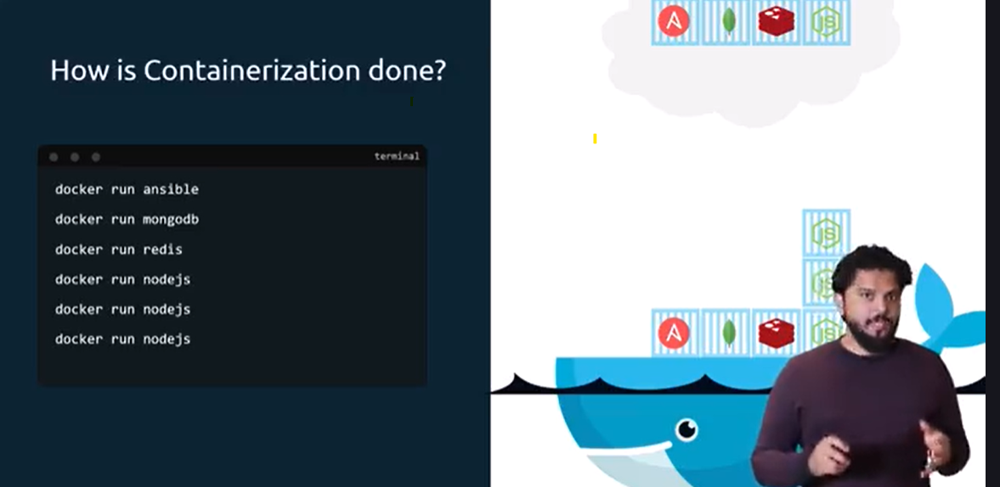

# We've been talking about images and containers.
Let's understand the difference between the two An image is a package or a template, just like a VM

template that you might have worked with in the virtualization world.

It is used to create one or more containers.

# Containers are running instances of images that are isolated and have their own environments and set of processes.

As we have seen before, a lot of products have been dockerized already.

In case you cannot find what you're looking for, you could create your own image and push it to Docker

Hub repository, making it available for public.

So if you look at it traditionally, developers developed applications.

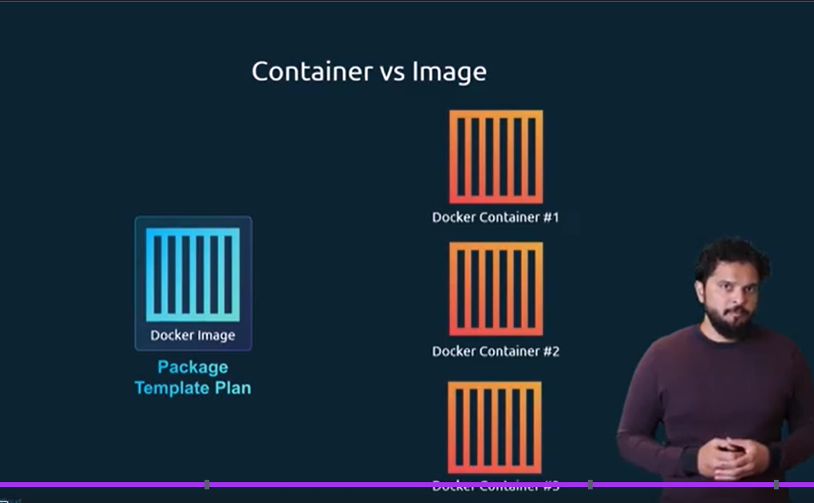
Then they hand it over to ops team to deploy and manage it in production environments.

They do that by providing a set of instructions, such as information about how the host must be set

up, what prerequisites are to be installed on the host, and how the dependencies are to be configured,

etc. since the ops team did not really develop the application on their own, they struggled with setting

it up when they hit an issue.

They work with the developers to resolve it.

With Docker, the developers and operations teams work hand in hand to transform the guide into a Docker

file with both of their requirements.

This Docker file is then used to create an image for their applications.

This image can now run on any host with Docker installed on it, and is guaranteed to run the same way

everywhere, so the ops team can now simply use the image to deploy the application.

Since the image was already working when the developer built it, and operations are have not modified

it, it continues to work the same way when deployed in production.
-----------------------
# SlideNo. 2
So we learned about containers and we now have our application packaged into a Docker container.

But what's next?
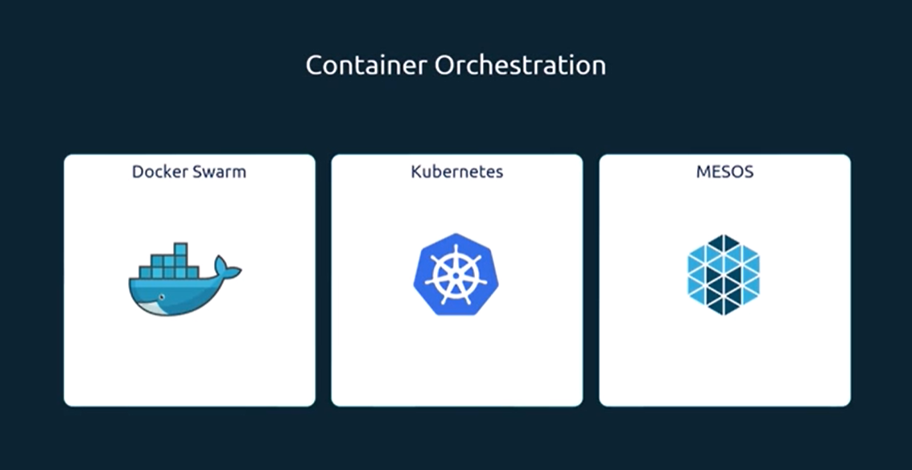

How do you run it in production?

What if your application relies on other containers, such as databases or messaging services or other

backend services?

What if the number of users increase and you need to scale your application?

How do you scale down when the load decreases?

To enable these functionalities, you need an underlying platform with a set of resources and capabilities.

The platform needs to orchestrate the connectivity between the containers and automatically scale up

or down based on the load.

This whole process of automatically deploying and managing containers is known as container orchestration.

Kubernetes is just a container orchestration technology.

There are multiple such technologies available today.

Docker has its own tool called Docker Swarm Kubernetes from Google and Mesos from Apache.

While Docker Swarm is really easy to setup and get started, it lacks some of the advanced features

required for complex applications.

Mesos. On the other hand, is quite difficult to setup and get started, but supports many advanced features.

# Kubernetes, arguably the most popular of it all, is a bit difficult to setup and get started, but

provides a lot of options to customize deployments and supports deployment of complex architectures.

Kubernetes is now supported on all public cloud service providers like GCP, Azure, and AWS, and the

Kubernetes project is one of the top ranked projects in GitHub.

# There are various advantages of container orchestration.

Your application is now highly available, as hardware failures do not bring your application down because

you have multiple instances of your application running on different nodes.

The user traffic is load balanced across the various containers.

When demand increases, deploy more instances of the application seamlessly and within a matter of seconds.

And we have the ability to do that at a service level when we run out of hardware resources.

Scale the number of underlying nodes up or down without having to take down the application, and do

all of these easily with a set of declarative object configuration files.
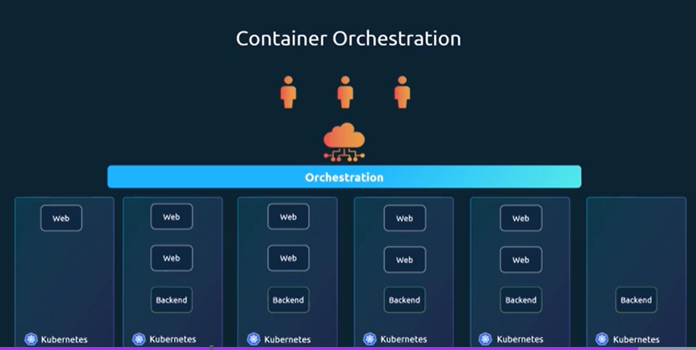
And that is Kubernetes.

And that is Kubernetes.
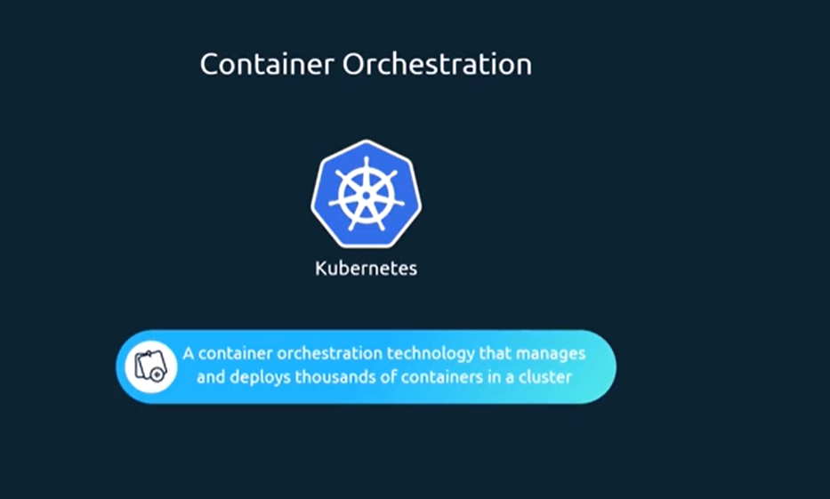

It is a container orchestration technology used to orchestrate the deployment and management of hundreds

and thousands of containers in a clustered environment.

------------------
# Slide 4  Architecture

This is to make sense of the terms that we will come across while setting up a Kubernetes cluster.

# Let us start with nodes.
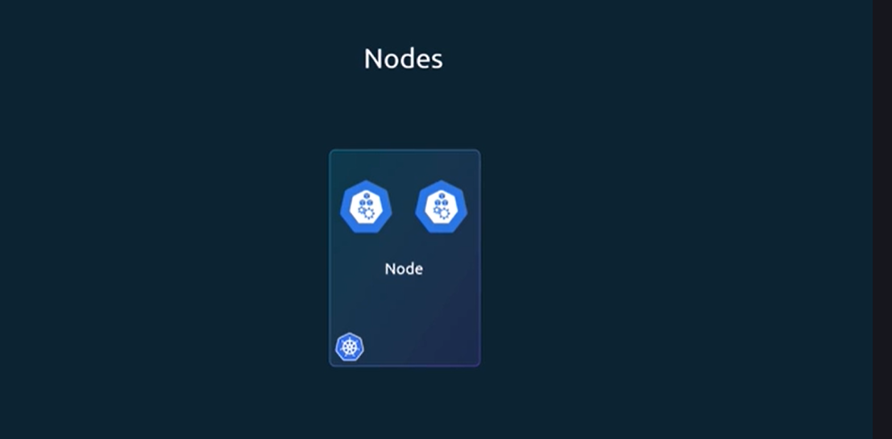
# A node is a machine, physical or virtual, on which Kubernetes is installed.
# A node is a worker machine and that is where containers will be launched by Kubernetes.
It was also known as minions in the past.

So you might hear these terms used interchangeably.

But what if the node on which your application is running fails?

Well, obviously our application goes down, so you need to have more than one nodes.

# A cluster is a set of nodes grouped together.
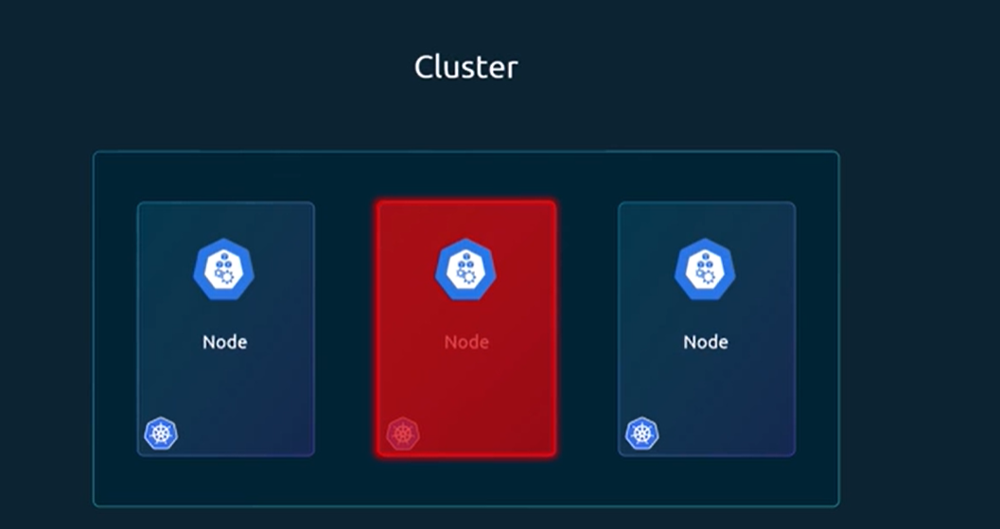
This way, even if one node fails, you have your application still accessible from the other nodes.

Moreover, having multiple nodes helps in sharing load as well.

Now we have a cluster.

# But who is responsible for managing the cluster?

# Where is the information about the members of the cluster stored?

# How are the nodes monitored?

# When a node fails, how do you move the workload of the failed node to another worker node?

# That's where the master comes in.
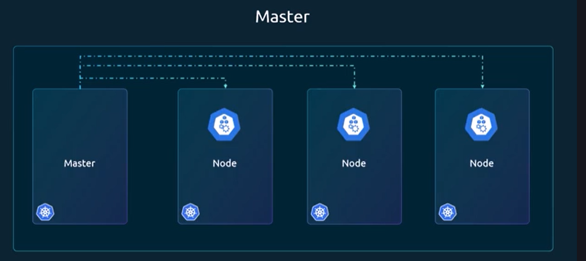
**The master is another node with Kubernetes installed in it and is configured as a master.

The master watches over the nodes in the cluster and is responsible for the actual orchestration of

containers on the worker nodes.**

**When you install Kubernetes on a system, you're actually installing the following components an API

server and etcd service, a Kubernetes service, a container, runtime controllers and schedulers.
**

# The API server acts as the front end for Kubernetes. The user's management devices, command line interfaces all talk to the API server to interact with the Kubernetes cluster.

**Next is the etcd keystore.
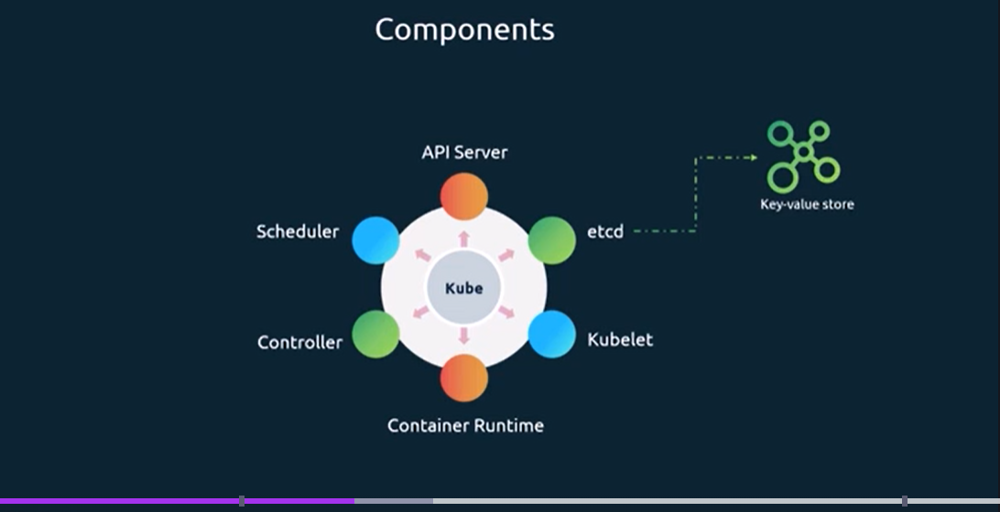
Etcd is a distributed, reliable key value store used by Kubernetes to store all data used to manage

the cluster.

Think of it this way when you have multiple nodes and multiple masters in your cluster, etcd stores

all that information on all the nodes in the cluster in a distributed manner.

Etcd is responsible for implementing locks within the cluster to ensure that there are no conflicts

between the masters,
**

**the scheduler is responsible for distributing work or containers across multiple nodes.It looks for newly created containers and assigns them to nodes.
**

**The controllers are the brain behind orchestration.

They're responsible for noticing and responding when nodes, containers, or endpoints goes down, the

controllers make decisions to bring up new containers.

In such cases, the container runtime is the underlying software that is used to run containers.

In our case, it happens to be Docker, but there are other options as well.**

**And finally, Kubelet is the agent that runs on each node in the cluster.

The agent is responsible for making sure that the containers are running on the nodes as expected.**

# So far we saw two types of servers master and worker, and a set of components that make up Kubernetes.

But how are these components distributed across different types of servers?

 # In other words, how does one server become a master and the other the slave?

The worker node, or minion as it is also known, is where the containers are hosted. For example, Docker containers.

And to run Docker containers on a system, we need container runtime installed. And that's where the container runtime falls.

In this case it happens to be Docker.

This doesn't have to be Docker.

There are other container runtime alternatives available, such as Rocket or Cryo.

But throughout this course we are going to use Docker as our container runtime engine.
**The master server has the kube API server and that is what makes it a master.

Similarly, the worker nodes have the Kubelet agent that is responsible for interacting with the master

to provide health information of the worker node and carry out actions requested by the master on the

worker nodes.

All the information gathered are stored in a key value store on the master.

The key value store is based on the popular etcd framework.**

**The master also has the control manager and the scheduler.

There are other components as well, but we will stop there for now.

The reason we went through this is to understand what components constitute the master and worker nodes.

This will help us install and configure the right components on different systems.**

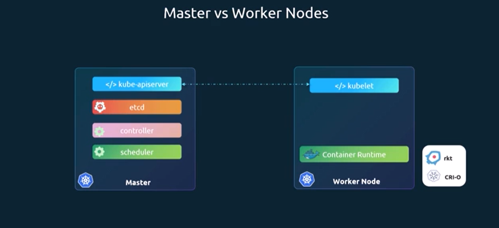

When we set up our infrastructure and finally, we also need to learn a little bit about one of the

command line utilities known as the cube command line tool or cube CTL or cube control, as 

# it is also called the cube control tool, is used to deploy and manage applications on a Kubernetes cluster toget cluster information, to get the status of other nodes in the cluster, and to manage many other things.

# The cube CTL run command is used to deploy an application on the cluster.

# The cube CTL cluster info command is used to view information about the cluster and 
# the cube CTL get nodes command is used to list all the nodes part of the cluster.

That's all we need to know for now and we will keep learning more commands throughout this course.

We will explore more commands with cube CTL when we learn the associated concepts.

-------------------------------------------

# Slide=8 Docker Vs Containerd
So you're going to come across Docker and container D many times going forward.

So when you read older blogs or documentation pages, you'll see Docker mentioned along with Kubernetes.

And when you read newer blogs you will see container D, and you'll wonder what the difference is between

the two.
And there are a few CLI tools like Ktor, CRI control or Node Control.

And you'll wonder what are these CLI tools and which one should you be using?

So that's what I'm going to explain in this video.

So that's what I'm going to explain in this video.

So let's go back in time to the beginning of the container era.

And in the beginning there was just Docker and there were other tools like rocket.

**But Docker's user experience made working with containers super simple, and hence Docker became the

most dominant container tool. And then came Kubernetes to orchestrate Docker.

So Kubernetes was built to orchestrate Docker specifically in the beginning.**

So Docker and Kubernetes were tightly coupled and back then Kubernetes only worked with Docker and didn't

support any other container solutions.

And then Kubernetes grew in popularity as a container orchestrator.

And now other container runtimes like rocket wanted in Kubernetes.

Users needed it to work with container runtimes that are other than just Docker.

**And so Kubernetes introduced an interface called Container Runtime Interface or CRE.
**

# So CRE allowed any vendor to work as a container runtime for Kubernetes as long as they adhere to the OCI standards.

# So OCI stands for Open Container Initiative, and it consists of an image spec and a runtime spec.

Image spec means the specifications on how an image should be built.

So that's what it defined.

# An image spec defined the specifications on how an image should be built, and 
# the runtime spec defined the standards on how any container runtime should be developed.

# So keeping these standards in mind, Anyone can build a container runtime that can be used by anybody to work with Kubernetes.

So rocket and other container runtimes that adhere to the OCI standards were now supported as container

runtimes for Kubernetes via the CRI.

However, Docker wasn't built to support the CRI standards because remember, Docker was built way before

CRI was introduced and Docker still was the dominant container tool used by most.

Kubernetes had to continue to support Docker as well.

And so Kubernetes introduced what is known as Docker shim, which was a hacky but temporary way to continue

to support Docker outside of the container runtime interface.

While most other container runtimes worked through the CRI, Docker continued to work without it.

Now you see Docker isn't just a container runtime alone.

Docker consists of multiple tools that are put together, for example, the Docker CLI, the Docker

API, the build tools that help in building images.

There was support for volumes of security.

And finally also the container runtime called Runcie, the daemon that managed Runcie.

And that's that was called as container D.

So container D is CLI compatible and can work directly with Kubernetes as all other runtimes.

So container D can be used as a runtime on its own separate from Docker.

So now you have container D as a separate runtime and Docker separately.

So Kubernetes continued to maintain support for Docker Engine directly.

However, having to maintain the Docker shim was an unnecessary effort and added complications, so

it was decided in version 1.24 release of Kubernetes to remove Dockershim completely, and so support

for Docker was removed.

But you see all the images that were built before Docker was removed.

But you see all the images that were built before Docker was removed.

So all the Docker images continue to work because Docker followed the image spec from the OCI standard.

So all the images built by Docker follow the standard.

So they continue to work with Containerd.

But Docker itself was removed as a supported runtime from Kubernetes.

So that's the whole story.
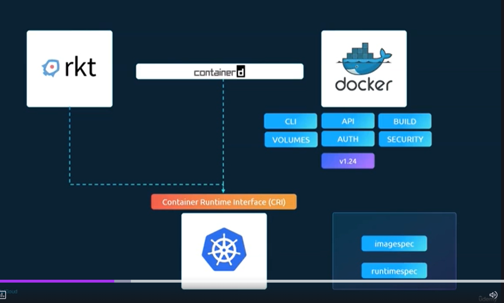

And now let's look into container D more specifically.

So container D although is part of Docker, is a separate project on its own now and is a member of

CNCF with the graduated status.

So you can now install container D on its own without having to install Docker itself.

So if you don't really need Docker's other features, you could ideally just install container D alone.

So typically we ran containers using the docker run command when we had Docker.

And if Docker isn't installed then how do you run containers with just To container D.

Now once you install container D, it comes with a command line tool called Ktor.

And this tool is solely made for debugging container D and is not very user friendly as it only supports

a limited set of features.

And this is what you can see in the documentation pages for this particular tool.

So for the other than the limited set of features that it provides, anything any other way that you

want to interact with container D, you'll have to rely on making API calls directly, which is not

the the most user friendly way for us to operate.

So just to give you an idea, this can be the Ktor command can be used to perform basic container related

activities such as pull images.

For example, to pull uh, redis image, you will run the ktor images pull command followed by the address

of the image.

And to run a container we use the CTL run command and specify the image address.

But as I mentioned, this tool is solely made for debugging container D and is not very user friendly

and not to be used for running or managing containers on a production environment, so a better alternative

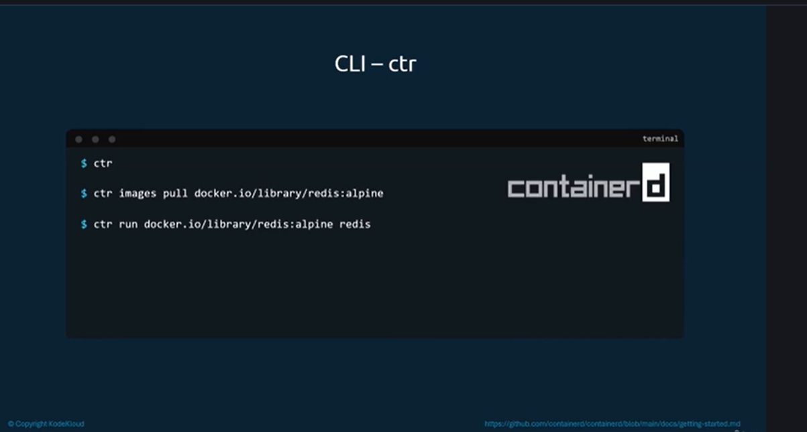

alternative

recommended is the nerd control tool or nerd CTL tool.

So the nerd control tool is a command line tool that's very similar to Docker.

So it's like Docker like CLI for container D.

It supports all or most of the options that Docker supports.

And apart from that it has the added benefit that it can give us access to the newest features implemented

into container D.

For example, we can work with the encrypted container images or other new feature that will eventually

be implemented into the Docker commands in the future.

It also supports lazy pulling of images, P2P image distribution, image signing and verifying and namespaces

in Kubernetes, which is not available in Docker.

So the nerd control tool works very similar to Docker CLI.

So instead of Docker, you would ideally simply have to replace it with node control.
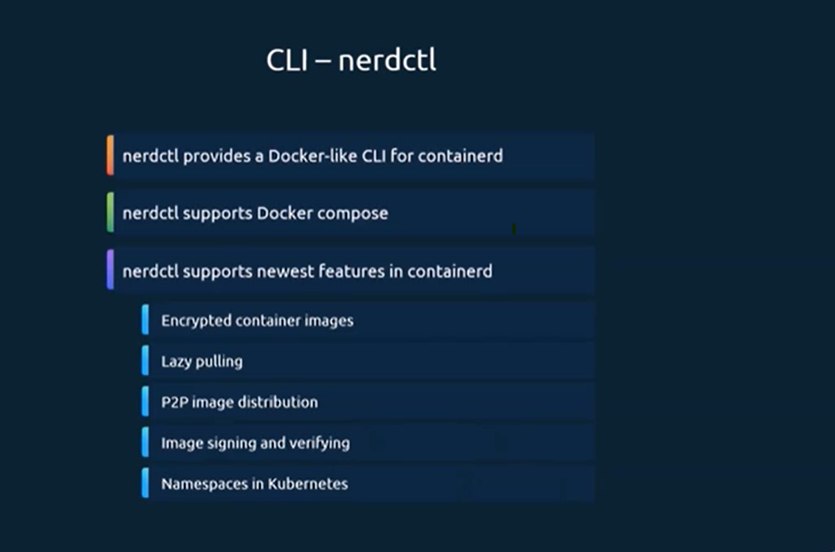
So you can run almost all Docker commands that interact with containers like this.

So some examples are instead of running the docker run command to create a container to run a container,

you could just use the inert control run command.

And similarly, let's say you want to use some options for port mappings or exposing ports with the

Dash P option for the docker run command, you could do the same with node control.

Simply replace Docker with node control.

So that's pretty easy and straightforward.
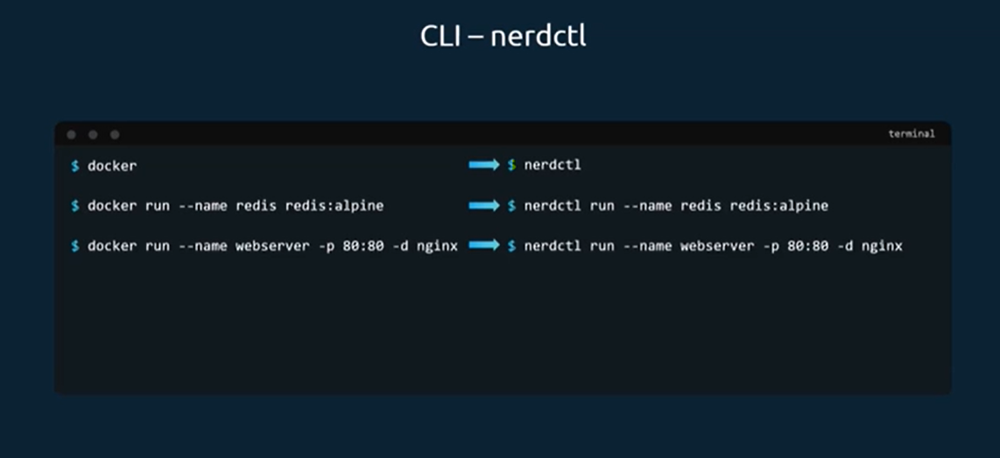

So now that we have talked about CTR and the node control tool, it's important to talk about another

command line utility known as CRI, CTL or CRI control.

So earlier we talked about the container Runtime interface or CRI which is a single interface used to

connect CRI compatible container runtimes the container, the rocket and others.
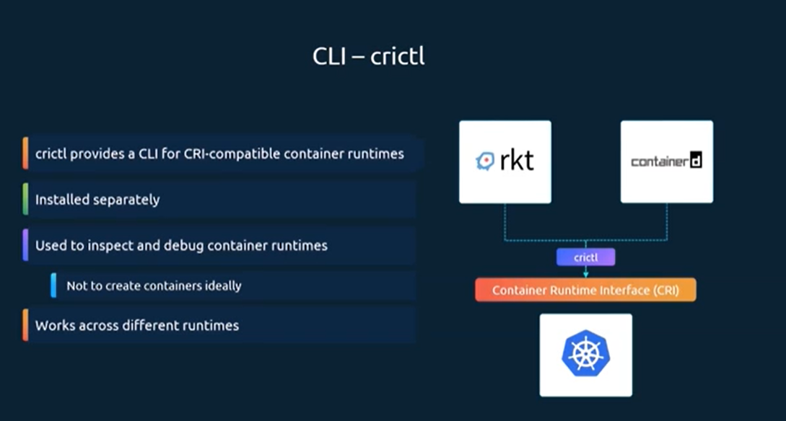
The CRI control is a command line utility that is used to interact with the CRI compatible container

runtime.

So this is kind of an interaction from the Kubernetes perspective.

So this tool is maintained by developed and maintained by the Kubernetes community.

And this is this tool works across all the different container runtimes as opposed to earlier, you

had the Ctor and the node control.
Tool that were built by the container community specifically for container D.

This particular tool is from the Kubernetes perspective that works across.

Different container runtimes.

So it must be installed separately.

And it is used to.

Inspect and debug container runtime.

So this again is not ideally used to create containers.

Unlike Docker or the node control utility this is again a debugging tool.

You can technically create containers with the CRI control utility, but it's not easy.

It's only to be used for some special debugging purposes.
 
Remember that it works along with the Kubelet, so we know that the Kubelet is responsible for ensuring

that the specific number of containers or pods are available on on node at a time.

**So if you go through the CRI control utility and try and create containers with it, then eventually

Kubelet is going to delete them because the Kubelet is unaware of some of those containers or pods that

are created outside of its knowledge.

So anything that it sees is going to go and delete it.

So because of those things, remember that the cry control utility is only used for debugging purposes

and getting into containers and all of that.
**
So let's look at some of the command line example

So you simply run the right control CRE CTL command for this.

And this can be used to perform basic container related activities such as pull images or list existing

images.

List containers very similar to the docker command where you use the PS command in docker.

You will run the PS command.

Here you would run the CRI control PS command and to run a command inside a container in Docker.

Remember we use the exact command and it's the same here along with the same options such as the dash,

I and T, and then you specify the container id and then the command that needs to be run to view the

logs.

Again you use the CRI control logs command very similar to Docker command.

And one major difference is that the CRI cry.

Control command is also aware of pods, so you can list pods by running the control pods command.

So this wasn't something that Docker was aware of.

So while working with Kubernetes in the past, we used Docker commands a lot to troubleshoot containers

and view logs, especially on the worker nodes.
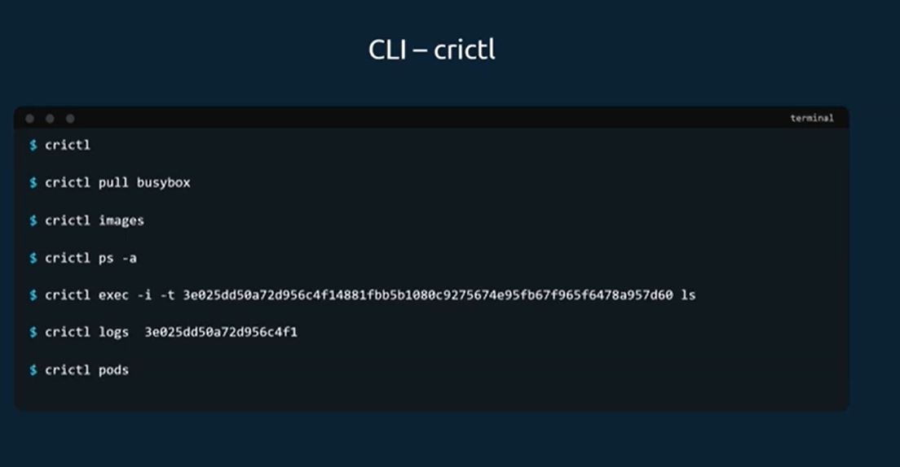

Now you're going to use the cry control command to do so.

The syntax is a lot similar.

So it shouldn't be shouldn't be really hard.

So here's a chart that lists the comparison between Docker and the cry control command line tool.

So as you can see, a lot of commands such as attach exec images, info, inspect logs, PS stats,

version, etc. work exactly the same way and some of the commands to create, remove and start and stop

images works similarly too.
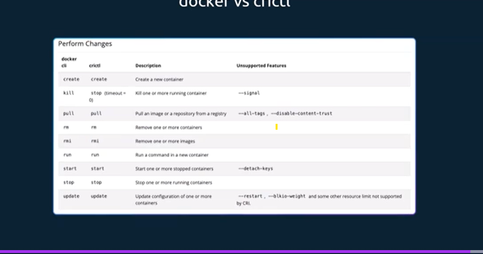

So a full list of differences can be found in the link given below.

Since, as I mentioned, cry control can be used to connect to any cry compatible runtime.

Remember to set the right endpoint if you have multiple container runtimes configured, or if you want

CRI control to interact with the specific runtime.

For example, if you haven't configured anything by default, it's going to connect to these sockets

in this particular order.

So it's going to try and connect to Dockershim first and then Containerd and then Cri-o.

And then you have the cri docker db.

That's the order that it follows.

But if you want to override that and set a specific endpoint, you use the runtime endpoint option with

the CRI control command line.

Or you could use the container runtime endpoint environment variable.

Set the environment variable to the right endpoint.

So to summarize, we have the Ktor command line utility that comes with Containerd and works with Containerd,

which is used for debugging purposes only and has a very limited set of features.

# Summarizing
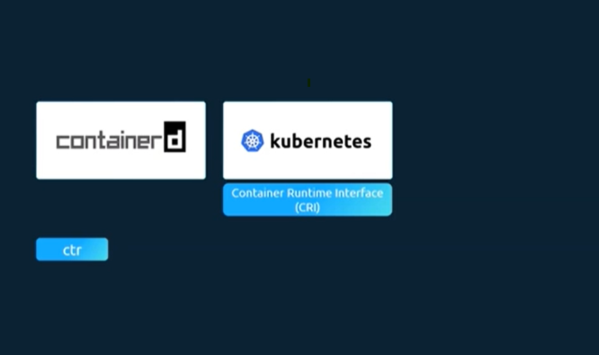
**ctr command line utility that comes with Containerd and works with Containerd,

which is used for debugging purposes only and has a very limited set of features.

So ideally you wouldn't be using this at all.

So you can ignore this.
**
**Then we have nerdctl**

**Then we have the nerd control CLI, which is again from the Containerd community.

But this is a docker like CLI for container D, used for general purpose to create containers and supports

the same or more features than docker CLI.

So this is something that I think we'll be using a lot more going forward.
**
# we hvae crictl

**And then we have the CRI control utility which is from the Kubernetes community, the mainly used to

interact with CRI compatible runtime.

So it's not just for container D.

This can be used for all CRI supported runtimes.

Again this is mainly for to be used for debugging purposes.
**
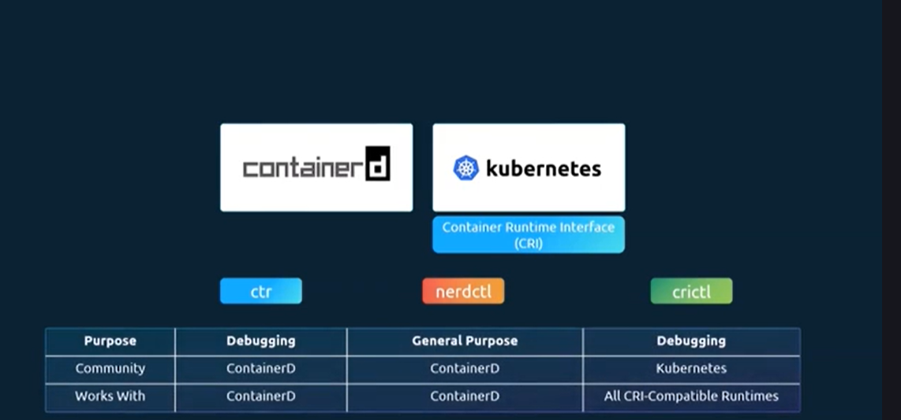
So if you look at the comparisons here you can see that CTR and CRI control are used mainly for debugging

purposes, whereas the control is used for general purpose.

The CTR and control are from the container the community and works with container D, whereas CRI control

is from the Kubernetes community and works across all CRI compatible runtimes.

So our labs originally had Docker installed on all the nodes.

So we used the Docker commands to troubleshoot.

But now it's all containerd.

So remember to use the the CRI control command instead to troubleshoot.

------------------------------
# Slide Docker Deprecation

Every time we mention about Docker in this course, one of the common questions we get is why are we

still talking about Docker if it's deprecated?

And I realized that there's some confusion about the Docker deprecation among students, and I just

wanted to take a minute to try and help clear that confusion.

So as we discussed before, Docker was the original and only supported container runtime for Kubernetes,

and to make Kubernetes open to other runtimes, we had the container runtime interface introduced.

So Docker consisted of multiple tools put together like Docker CLI, the API, the build tools that

help build images.
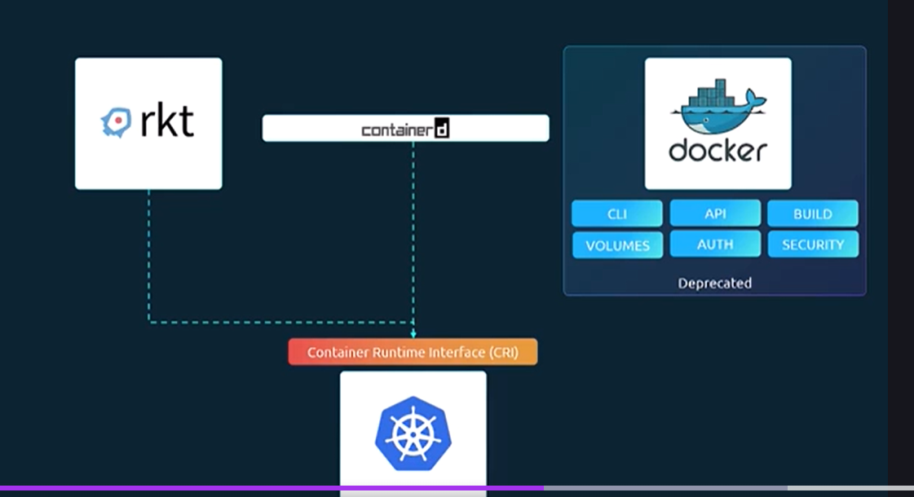

There was support for volumes, auth, security and finally also the container runtime called Runc and

the daemon that managed the runtime called the container.

So container D is the CLI compatible and can and that's the component that can work directly with Kubernetes.

And as all of the other runtimes.

So container D can be used as a runtime on its own separate from Docker.

So once this change was made, Kubernetes no longer needed.

The other tools that Docker supported like Docker CLI or the API, or build volumes or etc. as they

were all taken care of of by Kubernetes itself.

And so Kubernetes was able to deprecate the support for Docker.

Now that doesn't mean that Docker is entirely gone.

So Docker is still the most popular container solution out there and used by many in their day to day

development and build processes.

It's just that Kubernetes no longer required Docker as the runtime now.

So going forward in this course, every time we talk about containers, we use Docker as an example.

And that's absolutely fine because sometimes we learn how things work in containers first before looking

at how it is done in container orchestration world of Kubernetes.
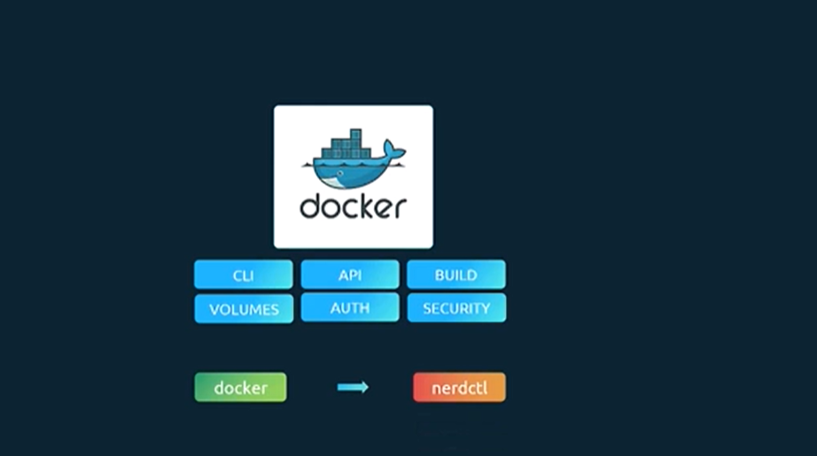
So and in those cases it is okay to use Docker as an example.

And if you don't happen to have Docker on your machine or are only using container D, then you can

still work with the same examples by replacing the docker command with the node control command, or

most of the time.

So I just wanted to throw that out there before we proceed.
# Quiz
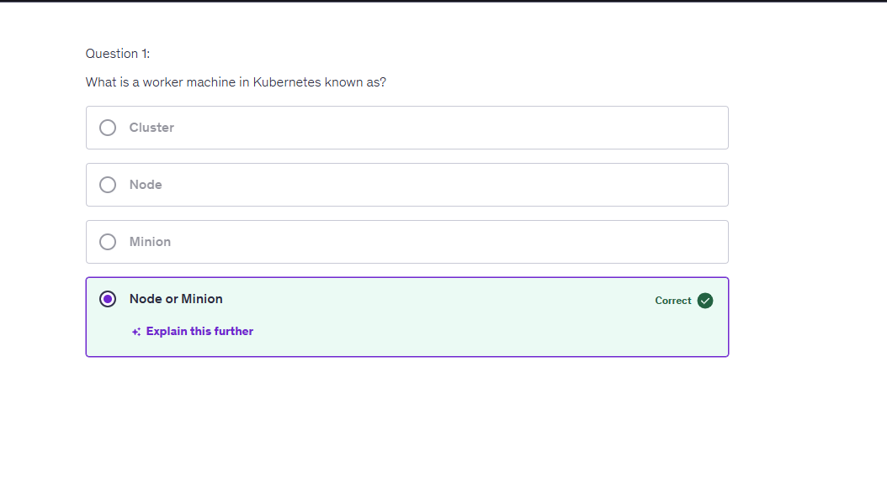
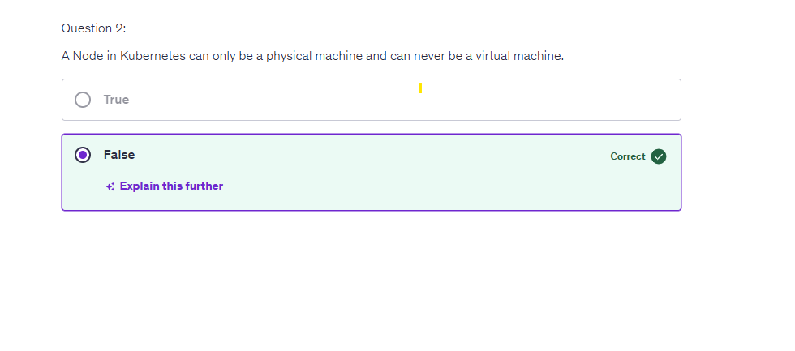
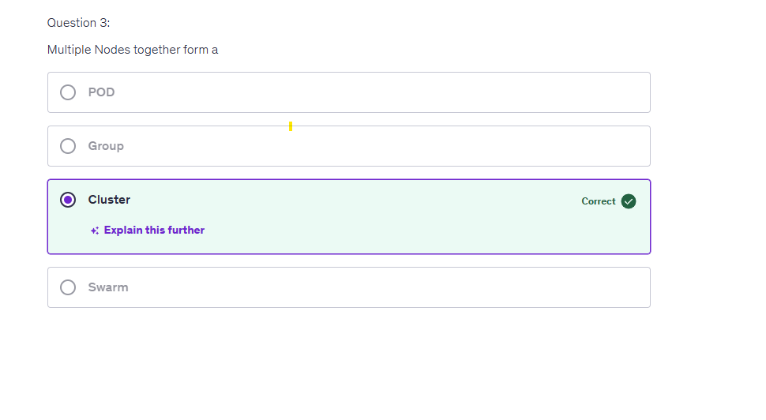
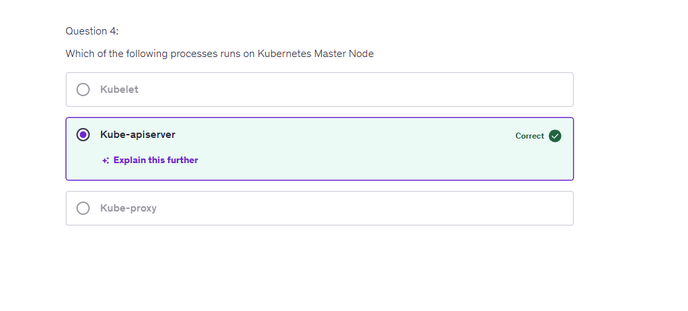
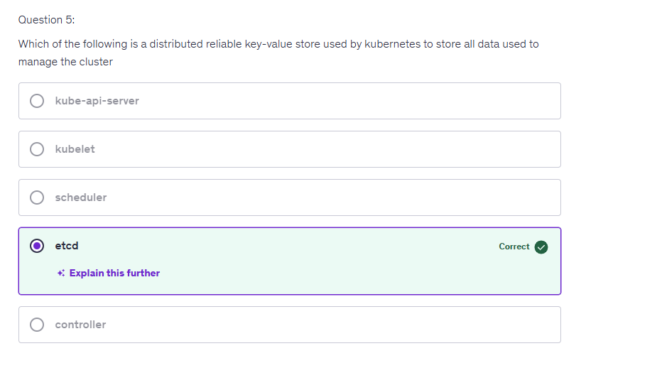
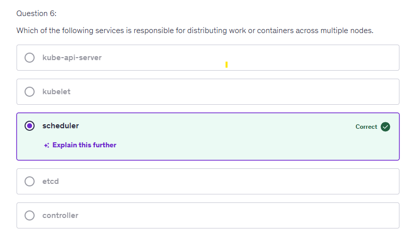
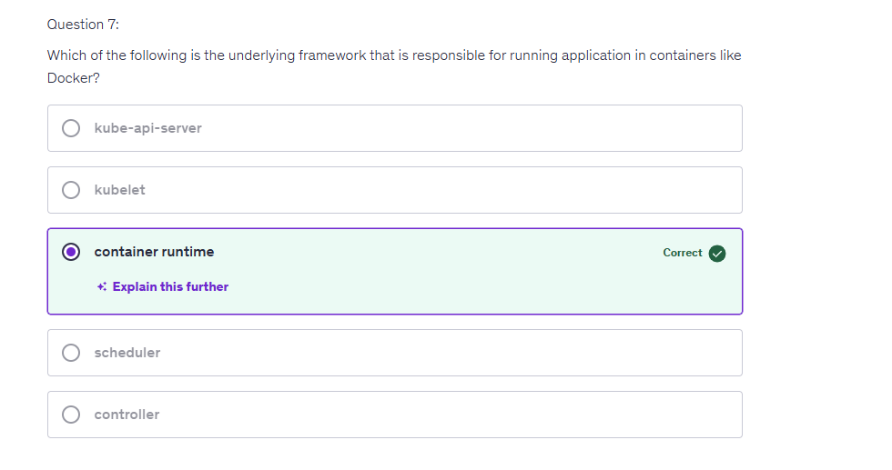
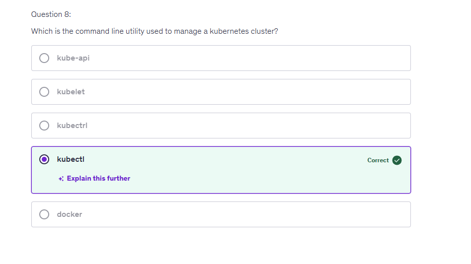

--------------------------------------------------------
# Section -3
# Slide Setting Up Kubernetes

Let us now look at how to set up a Kubernetes cluster and gain access to it.

So there are lots of ways to set up and get started with Kubernetes, so we can set it up ourselves

from scratch locally on our laptops or virtual machines.

Or we could use an existing managed service on a cloud provider, or you can access publicly accessible,
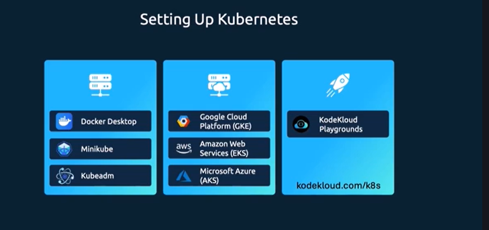
uh, playgrounds.

So for local systems, solutions like Docker Desktop, minikube and Kube admin are popular tools.

Docker desktop is probably the easiest to get started with, and as it has Kubernetes support built

in, and then you have minikube, which is a tool used to set up a single instance of Kubernetes in

an all in one setup.

And kube admin is a tool used to configure Kubernetes in a multi node setup, and we will look more

into that later.

There are also hosted versions available for setting up Kubernetes in a cloud environment such as GCP,

AWS or Azure.

And these are one click access.

So you just click a button and it provisions an entire Kubernetes cluster for you.

And then you gain access to it.

And you can just continue to work with it without spending time setting it up.

And finally, if you don't have the resources or if you don't want to go through this hassle of setting

it all up for yourself as part of your learning process, and you just want an instant access to a Kubernetes

cluster just to play with or run some commands and test test it around, then the best option is playgrounds.

So one of the playgrounds that are available provided by us is the cloud playgrounds that are accessible

at code Cloud.com.

I'll also show a little bit of information about that in a bit.

Now feel free to choose the one that is right for you.

You don't need to go through all of the demos.

Pick the ones that best suit your needs based on your time and resources.

So just starting with Docker Desktop.

So Docker Desktop is a free solution available with Docker.

So if you go to the Docker Docker website you have options to download and install Docker on all of

these different options that are available here.

So you have Docker for Docker Desktop for Mac, both for, um, silicon as well as Intel chips.

Similarly, you have Docker Desktop for windows, both for AMD and ARM chips, and then you have the

Docker for desktop for Linux.

Now once you, uh, set up and install Docker desktop, this is kind of the interface that you're going

to see.

You'll be able to see all the containers running and their information and a lot of other information.

The best part is that it comes with Kubernetes built in.

So if you go to settings and to Kubernetes section in the settings, all you need to do is enable Kubernetes

from there.

And it kind of sets up an instant Kubernetes cluster that you can play around with, uh, in the back

end.

So very easy to set up and gain access to Kubernetes.

The next option I'm going to show is the, uh, code cloud public playgrounds.
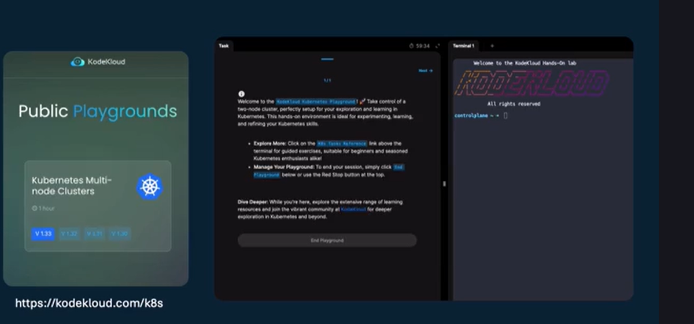

So, uh, this is built specifically for those who wants to have instant access to the, um, two,

a Kubernetes cluster, specifically a historical version of the cluster two.

So as you can see here, we currently support up to four historical versions of Kubernetes.

So if you want to see if you want to go back to a previous version of Kubernetes cluster and, you know,

compare and see features and differences between the clusters in between different versions, then this

is a really good option.

One click and you get this cloud Kubernetes playground open up in the right in the browser that you

can then refer to.

So moving on to minikube, which is another easy way to get started with Kubernetes on a local system.

So before we head into the demo, it's good to understand how it works.
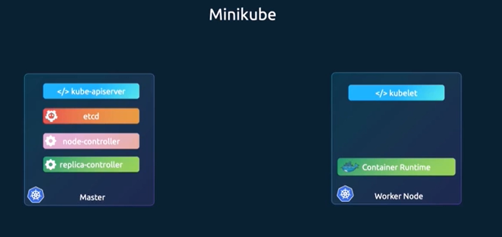
Earlier, we talked about the different components of Kubernetes that make up a control plane and worker

nodes such as the API server, etcd key value store controllers and scheduler on the master or the control

plane, and then you have the Kubernetes and container runtime on the worker nodes.

Now, it would take a lot of time and effort to set up and install all of these various components on

different systems, individually, by ourselves, which is why a mini cube bundles all of these different

components into a single image, providing us a pre-configured single node Kubernetes cluster so we

can get started in a matter of minutes.

Now, to make it easier, the whole bundle is packaged into an ISO image and is available online for

download.

Now you don't have to download it yourself.
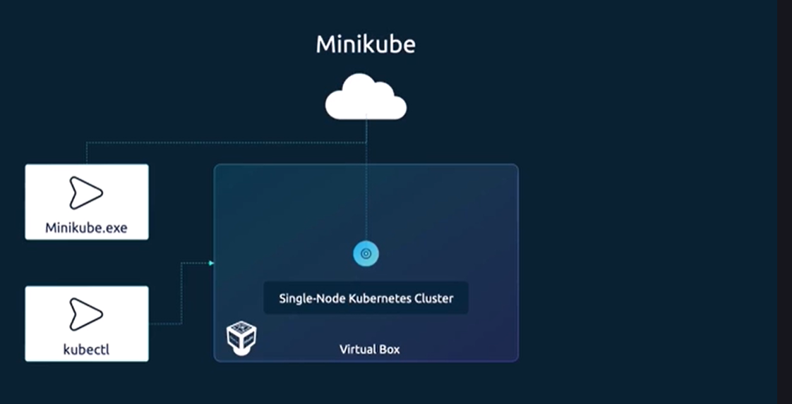
Minikube provides an executable command line utility that will automatically download the ISO image

and deploy it in a virtualization platform such as Oracle VirtualBox or VMware fusion.

So you must have a hypervisor installed on your system.

So for windows you would use VirtualBox or Hyper-V.

And for Linux you use VirtualBox or KVM.

And finally, to interact with the Kubernetes cluster, you must have the kubectl Kubernetes command

line tool also installed on your machine.

**So you need three things to get this working.

So you must have a hypervisor installed.

You have kubectl installed and you have minikube executable installed on your system.
**
Let's check it out.

-----------------------------
# Slide 4 Installed Minikube
In this demo, we are going to install a basic Kubernetes cluster using the minikube utility.

As part of this beginners course, to keep things simple and easy, we will stick to minikube as our

lab solution.

We explore additional options of provisioning Kubernetes cluster using the Kube admin tool in the course.

As for this course, we just want to stick to the very basics and all the basic operations can be performed

on minikube cluster.

It may be called kube control or kubectl or kubectl whatever you prefer.

Now you might hear me mix it up at times, so bear with me on that.

**So the kubectl command line tool is what we will use to manage our Kubernetes resources and our cluster

after it is set up using minikube and installing the kubectl utility before installing minikube will

allow minikube to configure the kubectl utility to work with the cluster when it provisions it.
**
**So the kubectl utility can work with multiple clusters, local or remote clusters at the same time.
**
And there's a small configuration for it.

And there's a small configuration for it.

And minikube will automatically take care of that when it starts when it provisions a Kubernetes cluster.

But that is if you already have the kubectl utility installed.

And finally we're going to move this to a location within the path usr local bin.

Okay.

So this way I'll be able to run this kubectl command from anywhere within my system.

So let's run the command and you can see that it has installed the 1.8 version.

Now that we have completed the installation of kubectl utility, we can proceed with the installation

of minikube.
**Now the first thing that we have to check, and this goes for all operating systems Linux, windows

or Mac is to make sure that virtualization is enabled for your laptop or desktop wherever you're setting

up this lab.
**
So one of the easy ways to make sure that virtualization is enabled on Linux is to grep for the VM or

the SCM keyword under the proc CPU info file.

So that's what I'm going to do now.

So as long as this command shows an output such as the switches listed here, virtualization has been

enabled.

And you don't have to enable it specifically from the Bios.

If it's not enabled then you have to check your laptop's Bios settings.

So you have to restart your laptop, go into the Bios and there should be an option to enable virtualization.

And you have to do that.

Um, you might have to check your laptop's manual, um, in order to know how that's done or just Check

online with your laptop model and search how to enable virtualization on your laptop.

And again, make sure that you check the documentation here for the respective operating system that

you are on.

For each of these, there are specific commands that can be used to run a test to see whether virtualization

has been enabled.

Okay.
So next we're going to install minikube.

And again we will go ahead with the option for Linux.

And the first prerequisite is to install kubectl which we have already done.

The next one is to install a hypervisor.

So for Linux we can either use KVM or VirtualBox.

Um we will go with VirtualBox as that is our preferred virtualization solution.

You can also run minikube without a hypervisor and directly on your host using Docker.

So if you already have Docker installed you could leverage that.
**And um kubectl utility is now configured to use the Kubernetes cluster provisioned using minikube.
**
-----------------------------------------------------

# Slide Pods
Before we head into understanding pods, we would like to assume that the following have been set up already.

At this point, we assume that the application is already developed and built into Docker images, and it is available on Docker repository like Docker Hub, so Kubernetes can pull it down.

We also assume that the Kubernetes cluster has already been set up and is working.

This could be a single node setup or a multi node setup.

Doesn't matter.
All the services need to be in a running state, as we discussed before with Kubernetes.

Our ultimate aim is to deploy our application in the form of containers on a set of machines that are configured as worker nodes in a cluster.
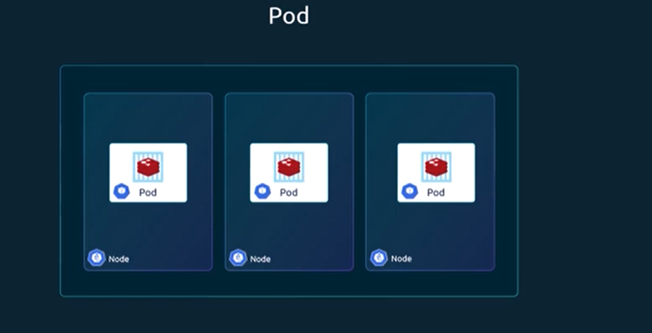
# However, Kubernetes does not deploy containers directly on the worker nodes.
# The containers are encapsulated into a Kubernetes object known as pods.
# A pod is a single instance of an application.

# A pod is the smallest object that you can create in Kubernetes.

**Here we see the simplest of simplest cases, where you have a single node Kubernetes cluster with a

single instance of your application running in a single Docker container encapsulated in a pod.

What if the number of users accessing your application increase and you need to scale your application?

You need to add additional instances of your web application to share the load.

Now where would you spin up additional instances?

Do we bring up new container instances within the same pod?
**
No.
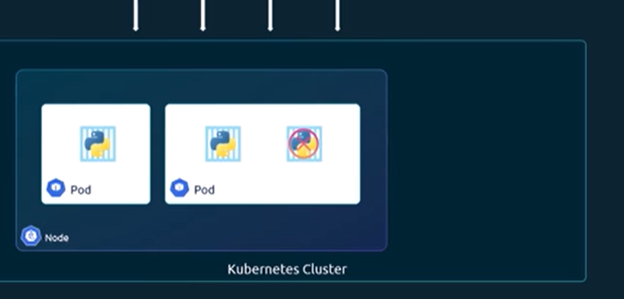

We create new pod altogether with a new instance of the same application.

As you can see, we now have two Instances of our web application running on two separate pods on the

same Kubernetes system or node.

**What if the user base further increases and your current node has no sufficient capacity?

Well, then you can always deploy additional pods on a new node in the cluster.
**

You will have a new node added to the cluster to expand the cluster's physical capacity.

So what I'm trying to illustrate in this slide is that pods usually have a 1 to 1 relationship, with

containers running your application.

To scale up, you create new pods, and to scale down you delete existing pods.

**You do not add additional containers to an existing pod to scale your application.
**
Also, if you're wondering how we implement all of this and how we achieve load balancing between containers,

etc., we will get into all of that in a later lecture.

# We just said that pods usually have a 1 to 1 relationship with the containers. But are we restricted to having a single container in a single pod?

No.

A single pod can have multiple containers, except for the fact that they're usually not multiple containers

of the same kind.

As we discussed in the previous slide, if our intention was to scale our application, then we would

need to create additional pods.

But sometimes you might have a scenario where you have a helper container that might be doing some kind

of supporting task for our web application, such as processing a user entered data, processing a file

uploaded by the user, etc. and you want these helper containers to live alongside your application

container.

In that case, you can have both of these containers part of the same pod, so that when a new application

container is created.

The helper is also created and when it dies, the helper also dies.

Since they are part of the same pod, the two containers can also communicate with each other directly

by referring to each other as local host, since they share the same network space.

Plus, they can easily share the same storage space as well.

If you still have doubts in this topic, I would understand if you did, because I did.

The first time I learned these concepts, we could take another shot at understanding pods from a different

angle.
The first time I learned these concepts, we could take another shot at understanding pods from a different

angle.

Let's for a moment keep Kubernetes out of our discussion and talk about simple Docker containers.

Let's assume we were developing a process or a script to deploy our application on a Docker host.

Then we would first simply deploy our application using a simple Docker run Python app command.

And the application runs fine and our users are able to access it.

When the load increases, we deploy more instances of our application by running the Docker run commands

many more times.

This works fine and we're all happy.

Now, sometime in the future, our application is further developed, undergoes architectural changes,

and grows and gets complex.
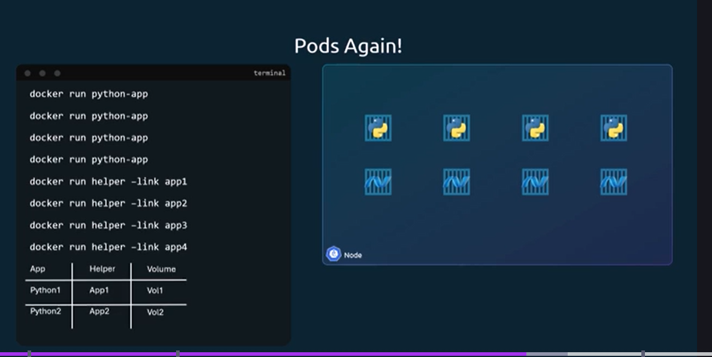
We now have a new helper container that helps our web application by processing or fetching data from

elsewhere.

These helper containers maintain a 1 to 1 relationship with our application container, and thus needs

to communicate with the application containers directly and access data from those containers.

For this, we need to maintain a map of what app and helper containers are connected to each other.

We would need to establish network connectivity between these containers ourselves using links and custom

networks.

We would need to create shareable volumes and share it among the containers.

We would need to maintain a map of that as well.

And most importantly, we would need to monitor the state of the application container and when it dies,

manually kill the helper container as well, as it's no longer required.

When a new container is deployed, we would need to deploy the new helper container as well with pods.

# Kubernetes does all of this for us automatically.

We just need to define what containers a pod consists of, and the containers in a pod by default will

have access to the same storage, the same network namespace, and same fate as in they will be created

together and destroyed together.

Even if our application didn't happen to be so complex and we could live with a single container, Kubernetes

still requires you to create pods, but this is good in the long run as your application is now equipped

for architectural changes and scale in the future.

However, also note that multi-part containers are a rare use case, and we're going to stick to single

containers per pod in this course.

Let us now look at how to deploy pods.

Earlier we learned about the Kube control run command.

What this command really does is it deploys a Docker container by creating a pod.

So it first creates a pod automatically and deploys an instance of the nginx docker image.

But where does it get the application image from?

For that you need to specify the image name using the image parameter.

The application image.

In this case the nginx image is downloaded from the Docker Hub repository Docker Hub.

As we discussed, is a public repository where Docker images of various applications are stored.

You could configure Kubernetes to pull the image from the public Docker hub or a private repository

within the organization.

Now that we have a pod created, how do we see the list of pods available?
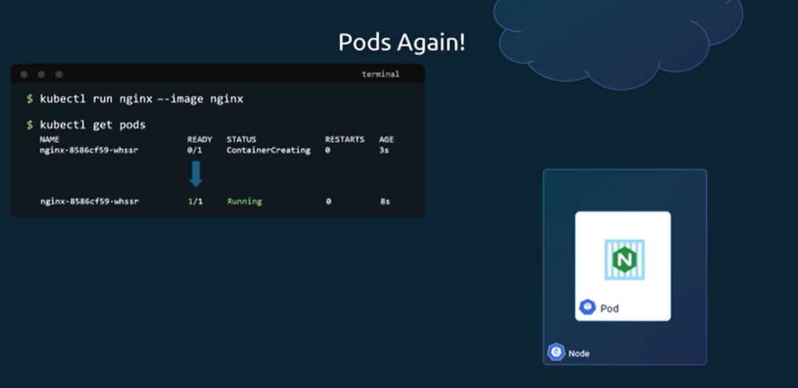
The Kube control get pods command helps us see the list of pods in our cluster.

In this case, we see the pod is in a container creating state and soon changes to a running state when

it is actually running.

Also, remember that we haven't really talked about the concepts on how a user can access the nginx

web server, and so in the current state, we haven't made the web server accessible to external users.

You can access it internally from the node.

But for now we will just see how to deploy a pod.

And later in a later lecture, once we learn about networking and services, we will get to know how

to make this service accessible to end users.

------------------------------------------------------------------
# Slide Demo Lecture

In this demo, we're going to deploy a pod in our minikube cluster.

As we discussed, a pod is the most basic and the smallest unit in Kubernetes.

So we will use the kubectl command line utility to interact with the Kubernetes cluster.
Now if you followed our demo earlier of deploying a cluster using minikube, then you already have the

kubectl command line utility configured to work with the cluster.

We will run the command kubectl run nginx, which is the name of the pod dash dash image uh equals to

nginx.

Now here is where we specify the Docker image to be used.

While the pod name could be anything, the image name has to be the name of an image available at Docker

Hub or any other container registry.

You can additionally specify a tag for the image name or a different address to an image hosted on another

registry.
If the image is hosted, uh, in a place that's, uh, other than Docker Hub.

Okay, so once we run this command, we see a pod by the name nginx.

Um has been created and you can check the status using the kubectl get pods command.

Now here you can see the column name which is nginx.

The status is running and we see that the.

There is a ready column which shows the number of containers in a ready state.

We also see if the container has restarted since it was created.

And how long has the pod been running?

We can get more information related to the pod by running the kubectl describe pod nginx command, and

you'll notice that this provides a lot more information as compared to the get command.

So for example, the name of the pod is nginx.

It shows any labels that has been assigned to this pod.

So this was created by default when we ran the run command.

It shows when it was started.

It shows the node that is uh, that it is assigned to along with the IP address of the node.

So in this case, we just have a single node cluster set up using minikube.

And the node name is minikube.

And that is the IP address of this worker node.

Secondly it also shows the IP address of the pod itself.

So in this case the pod is assigned an IP of 172.16.0.3.

We'll cover more about the IP addresses of the pod and later in the networking section.

Now moving on.

We can see that it displays information related to the container.

So we know that there is a single container which uses the image nginx.

If there were multiple containers we would list them here.

I'll explain about creating a pod with multiple containers in the upcoming lectures.
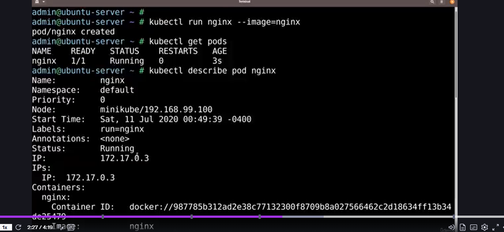
But here we can also see that the nginx image was pulled from Docker Hub.

And if you scroll all the way to the bottom, you'll see additional information called events.

And here you see the list of events that occurred since the pod was created.

And it went through multiple stages before it started.

We can see that the pod was assigned to the minikube node.

If there were multiple nodes, you would see which node the pod was assigned to here.

And then it entered the pulling phase where the nginx image was pulled down from Docker Hub successfully.

And then the container called nginx was created and started.

Now there is one other command that we can use to check the status of the pod, and that is the same

command as before.

The kubectl get pods command, but with the dash wide option.

And this provides additional information such as the node where the pod is running and the IP address

of the pod as well.

So this is the internal IP address of the pod itself.

So each pod gets an internal IP of its own within the within the Kubernetes cluster.

Um but more on that later.

That was a quick demonstration on how to run a pod in minikube environment.

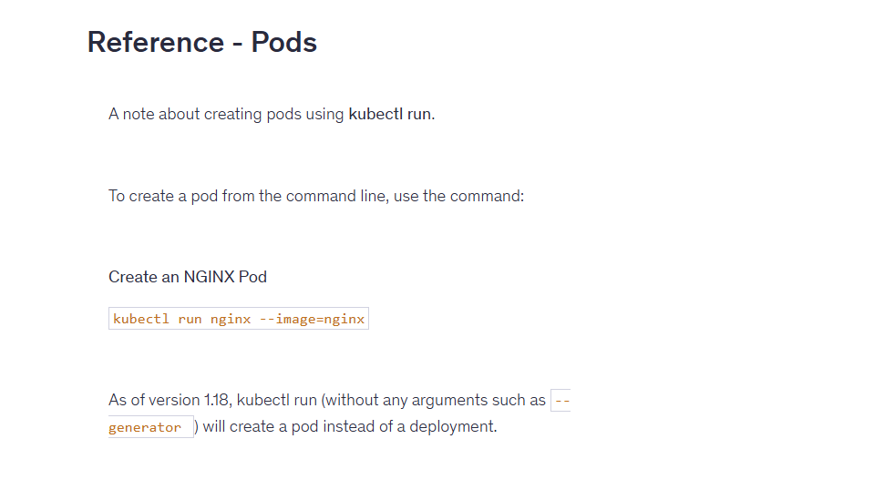

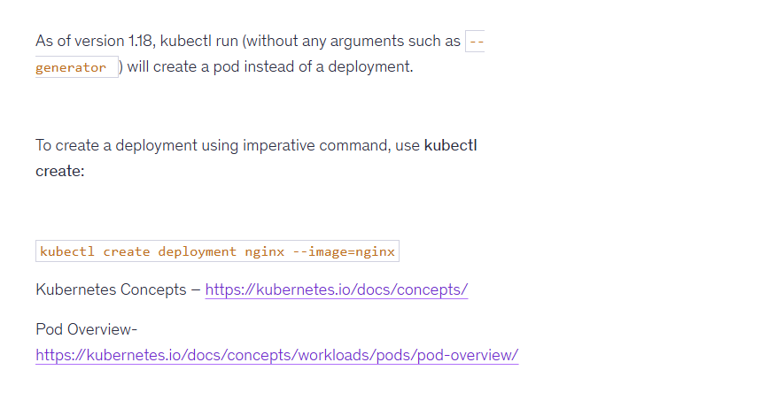

Kubernetes Concepts – https://kubernetes.io/docs/concepts/

Pod Overview- https://kubernetes.io/docs/concepts/workloads/pods/pod-overview/
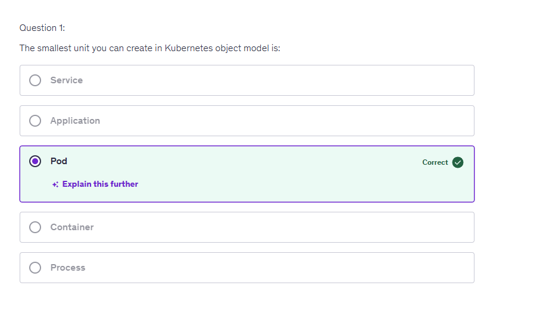
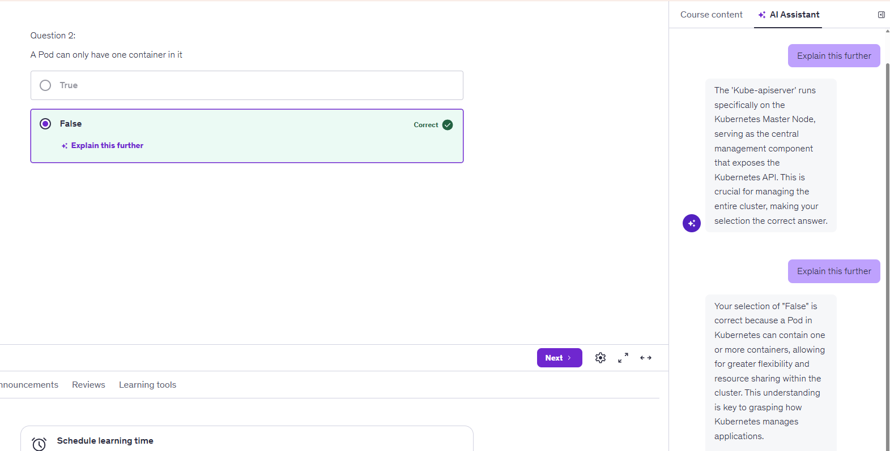

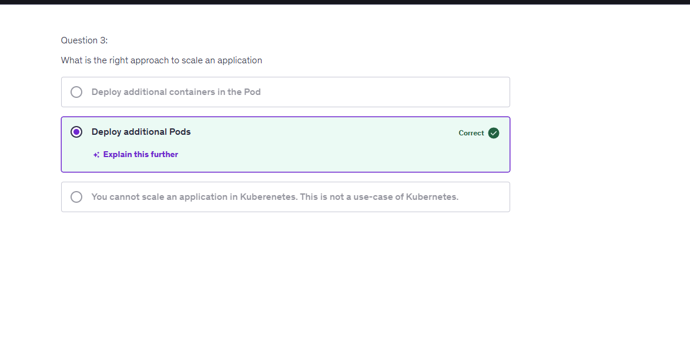
-------------------------------------------------------------

# Slide YAML
# In this lecture, we take a look at what YAML files are.

If you are familiar with YAML already, feel free to skip this section and head over to the next section.

# If you have not worked with YAML in the past, I would highly recommend going through this because the

rest of the course depends entirely on YAML.

**A YAML file is used to represent data, in this case configuration data.
**
Here is a quick comparison of a sample data in three different formats.
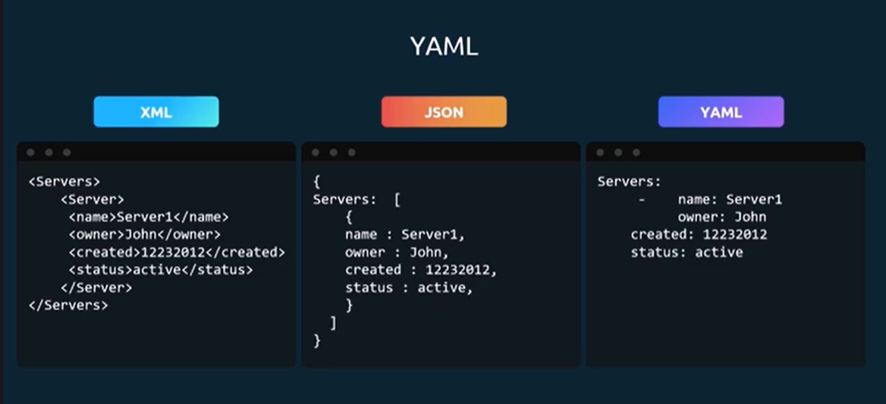
The one on the left is XML, where we display a list of servers and their information.

The same data is represented in JSON format in the middle.

And finally in YAML format to the right.

Take a minute to compare the three formats.

Let's take a close look at YAML.

If you take the data in its simplest form, such as key value pair, this is how you would define it

in YAML.

Key and value separated by a colon.

The keys are fruit, vegetable, liquid and meat and the values are apple, carrot, water, and chicken.
Remember you must have a space followed by colon, differentiating the key and the value.

Let's take a look at how an array is represented.

We would like to list some fruits and vegetables.

We would say fruits followed by a colon.

On the next line, enter each item with a dash in the front.

The dash indicates that it's an element of an array.

How about a dictionary?

A dictionary is a set of properties grouped together under an item.

Here we try to represent nutrition information of two fruits.

The calories, fat and carbs are are different for each fruit.
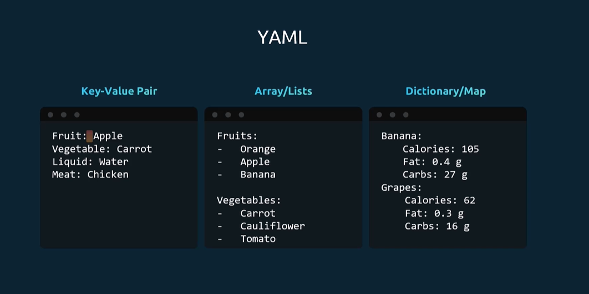
Notice the blank space before each item.

You must have equal number of blank spaces before the properties of a single item.

So they are all aligned together.

Let's take a closer look at spaces in YAML.

Here we have a dictionary representing the nutrition information of banana.

The total amount of calories, fat, and carbs are shown.
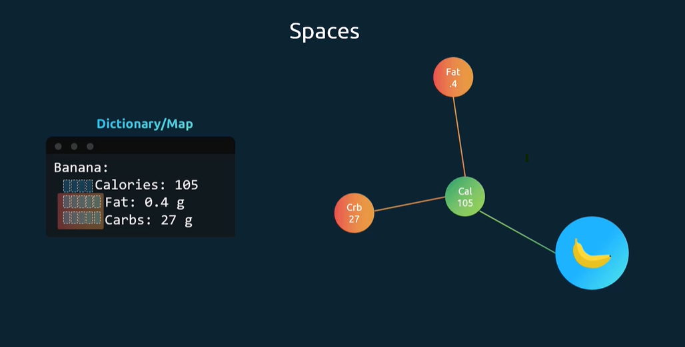
Notice the number of spaces before each property that indicates these key value pairs fall within banana.

Notice the number of spaces before each property that indicates these key value pairs fall within banana.

But what if we had extra spaces for fat and carbs?

Then they will fall under calories and thus become properties of calories, which doesn't make any sense.

This will result in a syntax error, which will tell you that mapping values are not allowed here because

calories already have a value set, which is 105.

You can either set a direct value or a hash map.

You cannot have both.

So the number of spaces before each property is key.
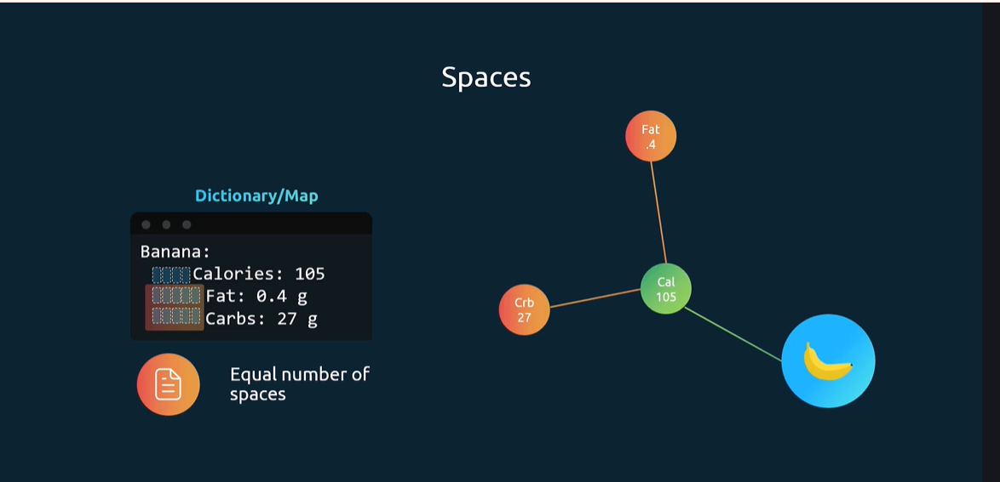

In YAML, you must ensure they are in the right form to represent your data correctly.

Let's take it to another level.

You can have lists containing dictionaries containing lists.
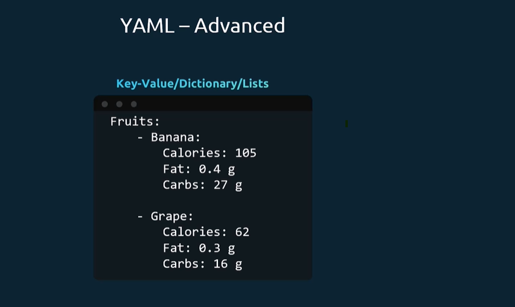

In this case, I have a list of fruits and the elements of the list are banana and grape, but each

of these elements are further dictionaries containing nutrition information.

A lot of students new to YAML have reached out to me asking when to use a dictionary or a list.

So let me explain this a little bit better.

First of all, it is important to understand that all of what we discussed so far, such as XML, JSON,

or YAML are used to represent data.

Or it could be data about an automobile manufacturing company and all of its cars and its details.

It could be anything.

Let's take an example of a car.

A car is a single object, and it has properties such as color, model, transmission, and price.

**To store different information or properties of a single object, we use a dictionary.**

In this simple dictionary, I have properties of the car defined in a key value format.

This may not be as simple as this.

For example, in case we need to split the model further into model name and make year, you could then

represent this as a dictionary within another dictionary.
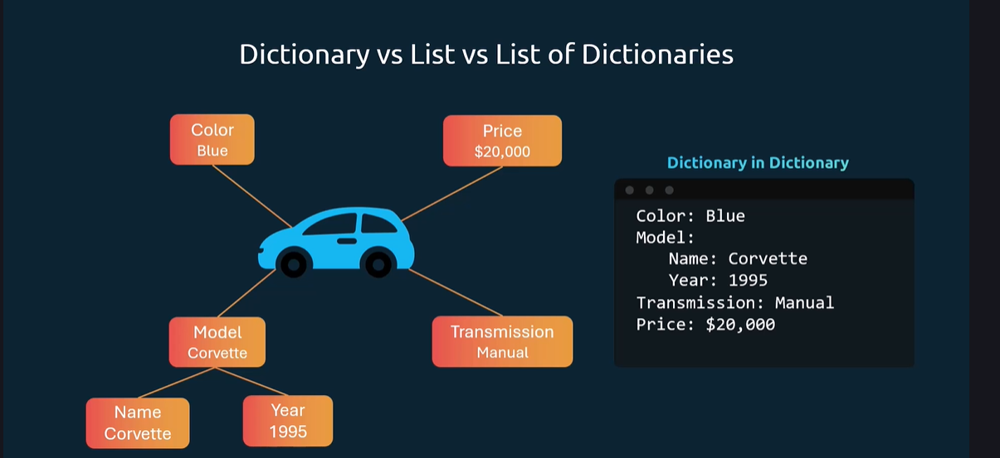
In this case, the single value of model is now replaced by a small dictionary with two properties name

and year.

So this is dictionary within another dictionary.

Let's say we would like to store the name of six cars.

**The names are formed by the color and the model of the car.

To store this we would use a list or an array as it is multiple items of the same type of object.

Since we are only storing the names, we have a simple list of strings.
**
What if we would like to store all information about each car?
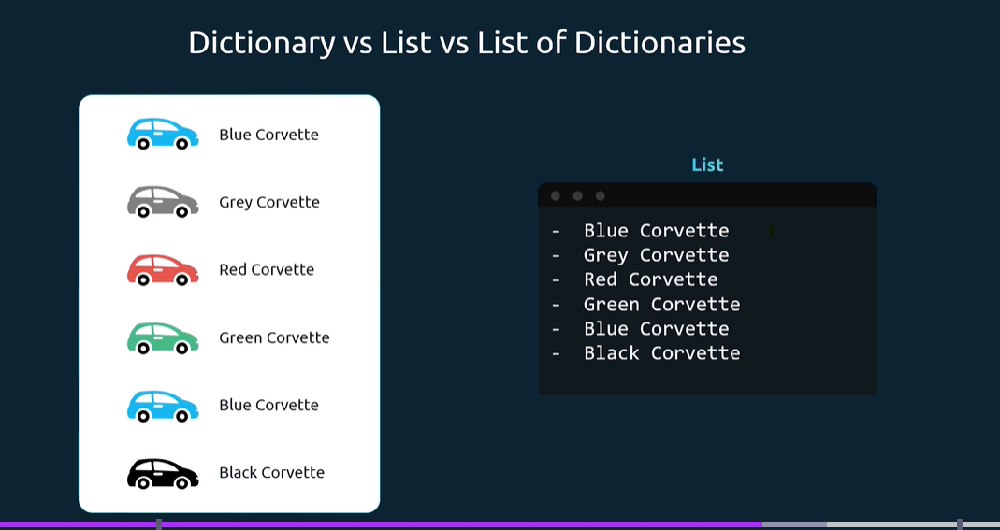

Everything that we listed before, such as the color, model, transition and price.

# We will then modify the array from a list of strings to a list of dictionaries.

So we expand each item in the array and replace the name with the dictionary we built earlier.

This way, we are able to represent all information about multiple cars in a single YAML file using

a list of dictionaries.
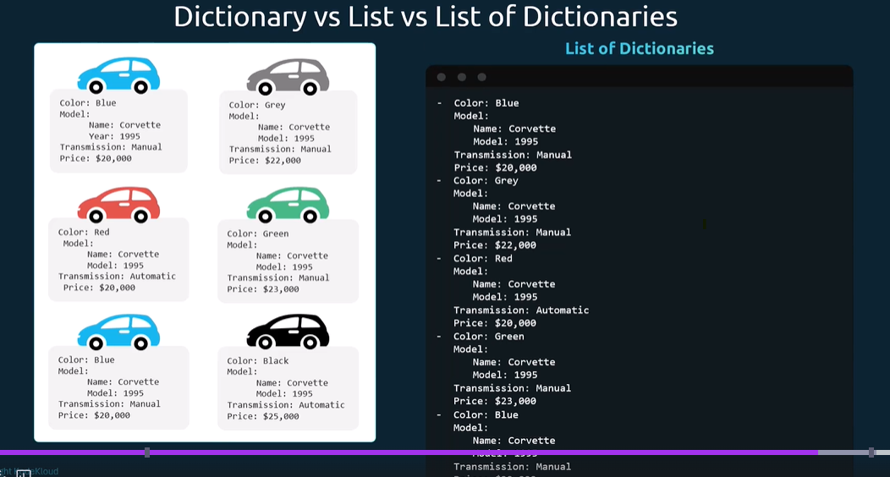

So that's the difference between dictionary list and list of dictionaries.

I hope you understood the difference between the three and when to use each of these.

Before we head over to exercises, let's take a look at some key notes.

**Dictionary is an unordered collection, whereas lists are ordered collection.
**
So what does that mean?

The two dictionaries that you see here have the same properties for banana.
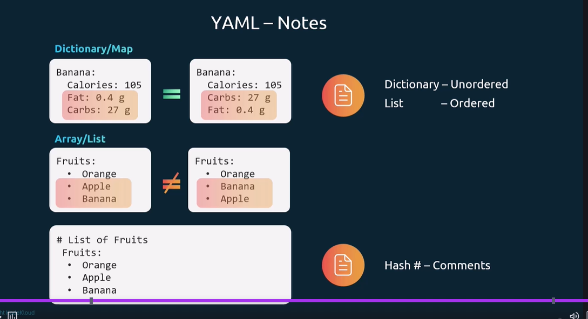

However, you can see that the order of properties fat and carbs do not match.

In the first dictionary, fat is defined before carbs, and in the second dictionary carbs comes first,

followed by fat.

But that doesn't really matter.

The properties can be defined in any order, but the two dictionaries will still be the same as long

as the values of each property match.

This is not the same for lists or arrays.

Arrays are ordered collection, so the order of items matter.
--------------------------------------------------------------------------------------

# YAML in Kubernetes

In this lecture we will talk about creating a pod using a YAML based configuration file.

**Kubernetes uses YAML files as inputs for the creation of objects such as pods, replicas, deployments,

services, etc. all of these follow a similar structure.

A Kubernetes definition file always contains four top level fields the API version, kind, metadata,

and spec.

These are the top level or root level properties.

These are also required fields, so you must have them in your configuration file.
**
Let us look at each one of them.
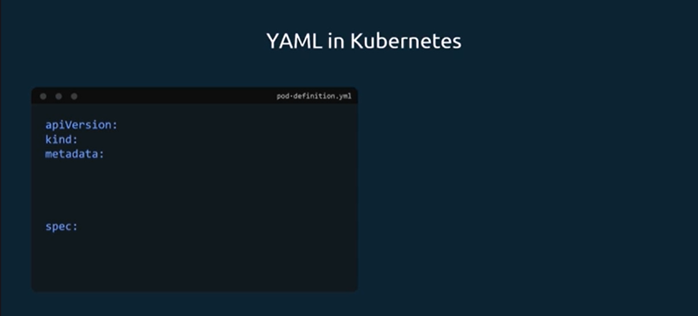
# The first one is the API version.

# This is the version of the Kubernetes API we are using to create the object.

# Depending on what we are trying to create, we must use the right API version.

# For now, since we are working on pods, we will set the API version as v1.

# Few other possible values for this field are. Apps v1, beta, extensions v1, beta, etc. we will see what these are for later in this course.

# Next is the kind.

# The kind refers to the type of object we are trying to create, which in this case happens to be a pod.

# So we will set it as pod.

# Some other possible values here could be replica set or deployment or service, which is what you see in the kind field in the table on the right.

# The next kind is metadata.
# The metadata is data about the object like its name, labels, etc. as you can see, unlike the first two where you have specified a string value, this is in the form of a dictionary.
So everything under metadata is intended to the right a little bit. 
# And so names and labels are children of metadata. The number of spaces before the two properties name and labels doesn't matter, but they should be the same as they are siblings.
In this case, labels has more spaces on the left than name, and so it is now a child of the name property

instead of a sibling, which is incorrect.

Also, the two properties must have more spaces than its parent, which is metadata, so that it's intended

to the right a little bit.

In this case, all three of them have the same number of spaces before them, and so they are all siblings,

which is not correct under metadata.

The name is a string value, so you can name your pod my app pod and the labels is a dictionary.

So labels is a dictionary within the metadata dictionary.

And it can have any key and value pairs as you wish.

For now I have added a label app with the value My app.

Similarly, you could add other labels as you see fit, which will help you identify these objects at

a later point in time.

Say for example, there are hundreds of pods running a front end application and hundreds of pods running

a back end application or a database.

It will be difficult for you to group these pods once they are deployed.

If you label them now as front end, back end, or database, you will be able to filter the pods based

on this label at a later point in time.

It's important to note that under metadata, you can only specify name or labels or anything else that

Kubernetes expects to be under metadata.

You cannot add any other property as you wish under this.
However, under labels you can have any kind of key or value pairs as you see fit.

So it's important to understand what each of these parameters expect.

So far, we have only mentioned the type and name of the object we need to create, which happens to

be a pod with the name Myapp pod.

But we haven't really specified the container or image we need in the pod.

# The last section in the configuration file is the specification section, which is written as spec.

Depending on the object we are going to create.

# This is where we would provide additional information to Kubernetes pertaining to that object.

**This is going to be different for different objects.
**
# So it's important to understand or refer to the documentation section to get the right format for each.

Since we are only creating a pod with a single container in it, it is easy.

# Spec is a dictionary, so add a property under it called containers.

 # Containers is a list or an array.

The reason this property is a list is because the pods can have multiple containers within them, as

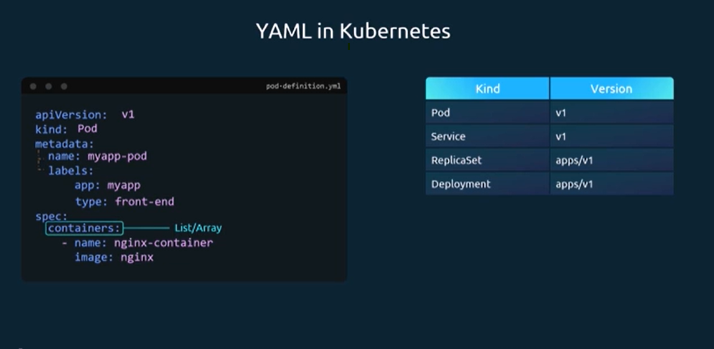

In this case though, we will only add a single item in the list since we plan to have only a single

container in the pod.

The dash right before the name indicates that this is the first item in the list.
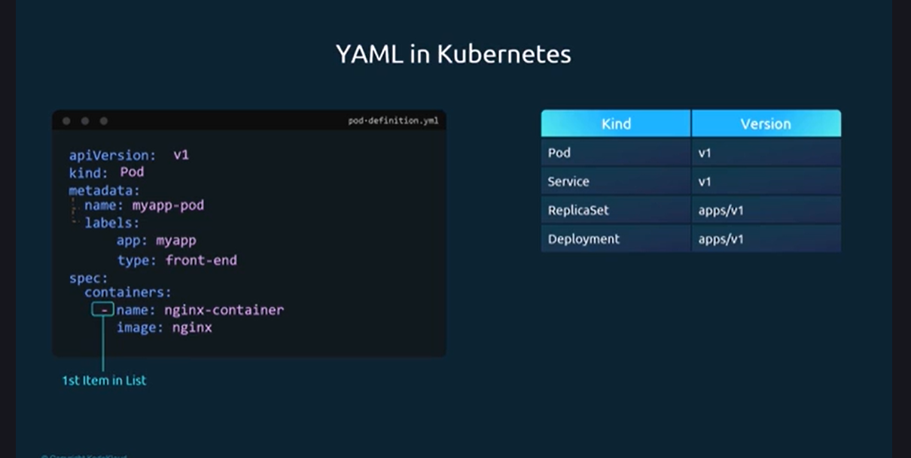
The item in the list is a dictionary, so add a name and image property.

The value for image is nginx, which is the name of the Docker image in the Docker repository.

**Once the file is created, run the command kubectl create dash f followed by the file name, which is

pod definition dot YAML and Kubernetes creates the pod.
**
# So to summarize, remember the four top level properties API version kind, metadata and spec.

Then start by adding values to those depending on the object you are going to create.

Once we create the pod, how do you see it?

# Use the kubectl get pods command to see a list of pods available.

In this case, it's just one.

# To see detailed information about the pod, run the kubectl describe pod command.

# This will tell you information about the pod when it was created, what labels are assigned to it,
what Docker containers are part of it, and the events associated with that pod.

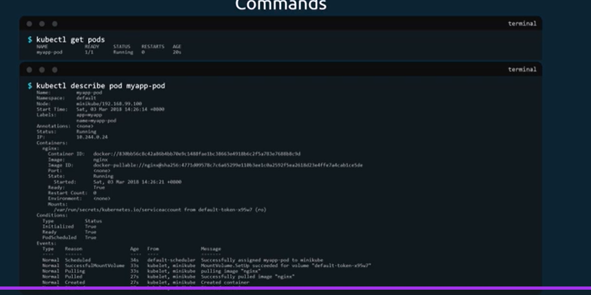

-------------------
# Demo Pod

# kubectl create and kubectl apply command, So the create and apply command kind of works the same. Um if you are creating a new object right, You can either user
create or you can use apply, um it doesn't matter

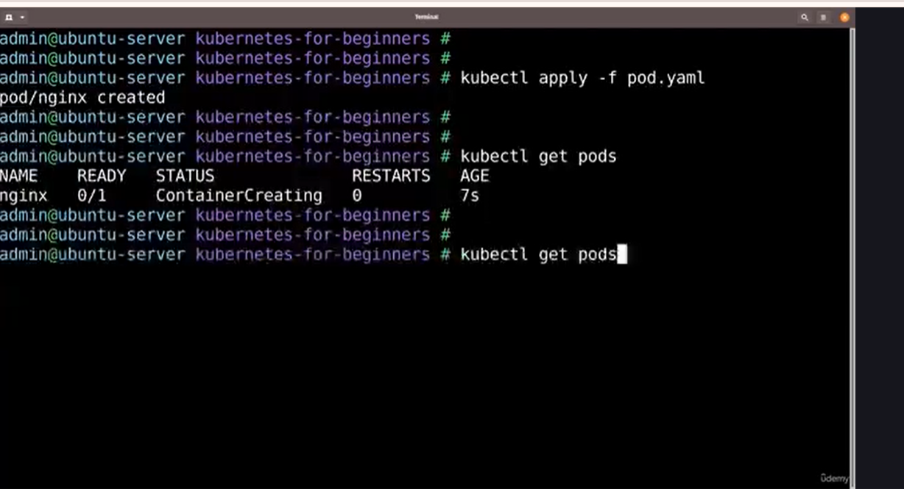

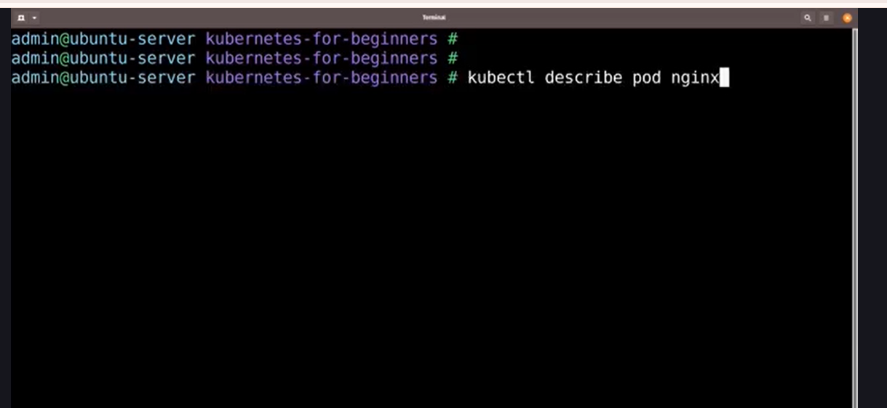

--------------------
Docker Volume

When you install Docker on a system, it creates this folder structure.

At var lib docker you have multiple folders under it called aufs, containers, image volumes, etc.

this is where Docker stores all its data by default.

When I say data, I mean files related to images and containers running on the Docker host.

For example, all files related to containers are stored under the containers folder, and the files

related to images are stored under the image folder.

Any volumes created by the Docker containers are created under the volumes folder.

Well, don't worry about that for now.

We will come back to that in a bit.

For now, let's just understand where Docker stores its files and in what format.

So how exactly does Docker store the files of an image and a container?

To understand that, we need to understand Dockers layered architecture.

# Let's quickly recap something we learned when Docker builds images, it builds these in a layered architecture.

# Each line of instruction in the Docker file creates a new layer in the Docker image, with just the

changes from the previous layer.
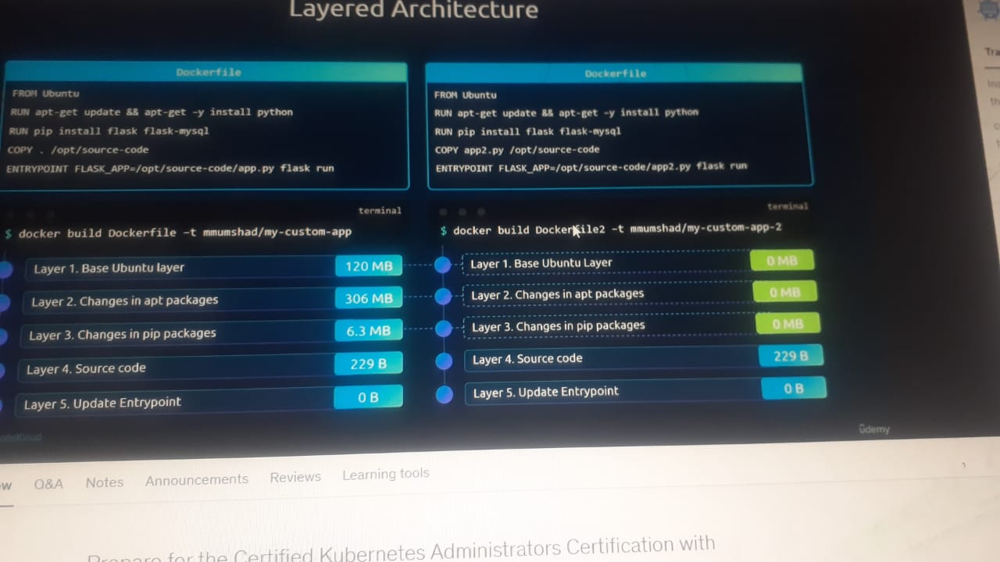

For example, the first layer is a base ubuntu distribution, followed by the second instruction that

creates a second layer which installs all the apt packages, and then the third instruction creates

a third layer, which with the Python packages, followed by the fourth layer that copies the source

code over, and then finally the fifth layer that updates the entry point of the image.

Since each layer only stores the changes from the previous layer, it is reflected in the size as well.

If you look at the base ubuntu image, it is around 120MB in size.

The APT packages that are installed is around 300 MB and then the remaining layers are small.

To understand the advantages of this layered architecture, let's consider a second application.

This application has a different Docker file, but is very similar to our first application.

As in, it uses the same base image as ubuntu.

Uses the same Python and Flask dependencies, but uses a different source code to create a different

application.

And so a different entry point as well.

When I run the docker build command to build a new image for this application, since the first three

layers of both the applications are the same, Docker is not going to build the first three layers.

Instead, it reuses the same three layers it built for the first application from the cache, and only

creates the last two layers with the new sources and the new entry point.

This way Docker builds images faster and efficiently saves disk space.

This is also applicable if you were to update your application code whenever you update your application

code, such as the app dot Pi.

In this case, Docker simply reuses all the previous layers from cache and rebuilds the application

image by updating the latest source code, thus saving us a lot of time during rebuilds and updates.
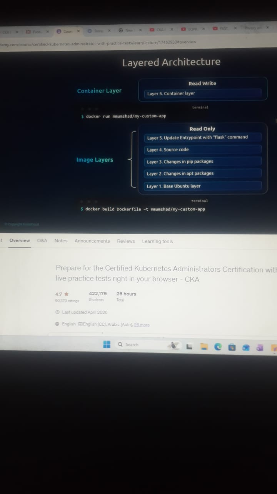

Let's rearrange the layers bottom up so we can understand it better.

At the bottom we have the base ubuntu layer, then the packages, then the dependencies, and then the

source code of the application and then the entry point.

All of these layers are created when we run the docker build command to form the final Docker image.

So all of these are the Docker image layers.

Once the build is complete, you cannot modify the contents of these layers.

And so they are read only.

And you can only modify them by initiating a new build.

When you run a container based off of this image using the docker run command, Docker creates a container

based off of these layers and creates a new writable layer on top of the image layer.

The writable layer is used to store data created by the container, such as log files written by the

applications.

Any temporary files generated by the container, or just any file modified by the user on that container.

The life of this layer, though, is only as long as the container is alive.

When the container is destroyed, this layer and all of the changes stored in it are also destroyed.

Remember that the same image layer is shared by all containers created using this image.

If I were to log in to the newly created container and say create a new file called temp dot txt, it

will create that file in the container layer which is read and write.

We just said that the files in the image layer are read only, meaning you cannot edit anything in those

layers.

Let's take an example of our application code.

Since we bake our code into the image, the code is part of the image layer and as such is read only

after running a container.

What if I wish to modify the source code to say, test a change?

Remember, the same image layer may be shared between multiple containers created from this image.

So does it mean that I cannot modify this file inside the container.

No, I can still modify this file, but before I save the modified file, Docker automatically creates

a copy of the file in the read write layer, and I will then be modifying a different version of the

file in the read write layer.

All future modifications will be done on this copy of the file in the read write layer.

This is called copy on write mechanism.

The image layer being read only just means that the files in these layers will not be modified in the

image itself.

So the image will remain the same all the time until you rebuild the image using the docker build command.

# What happens when we get rid of the container?

All of the data that was stored in the container layer also gets deleted.

The change we made to the App.py and the new temp file we created will also get removed.

# So what if we wish to persist this data.

For example, if we were working with a database and we would like to preserve the data created by the

container, we could add a persistent volume to the container.

To do this, first create a volume using the Docker volume create command.

So when I run the Docker volume create data underscore volume command, it creates a folder called data

underscore volume under the var lib docker volumes directory.

Then when I run the docker container using the docker run command, I could mount this volume inside

the Docker containers rewrite layer using the dash v option like this.

So I would do a docker run dash v, then specify my newly created volume name, followed by a colon

and the location inside my container, which is the default location where MySQL stores data.

And that is var lib MySQL.

And then the image name MySQL.

# This will create a new container and mount the data volume we created into var lib MySQL folder inside the container.

# So all data written by the database is in fact stored on the volume created on the docker host.

Even if the container is destroyed, the data is still active.

# Now what if you didn't run the Docker volume?

Create command to create the volume before the docker run command.

For example, if I run the docker run command to create a new instance of MySQL container with the volume

data underscore volume two, which I have not created yet, Docker will automatically create a volume

named data, underscore volume two and mount it to the container.

You should be able to see all these volumes if you list the contents of the var lib docker volumes folder.

# This is called volume mounting as we are mounting a volume created by Docker under the var lib docker volumes folder.

# But what if we had our data already at another location?

For example, let's say we have some external storage on the docker host at forward slash data, and

we would like to store database data on that volume and not in the default var lib docker volumes folder.

In that case we would run a container using the command docker run dash v, but in this case we will

provide the complete path to the folder we would like to mount that is forward slash data or slash MySQL.

And so it will create a container and mount the folder to the container.

# This is called bind mounting.

 # So there are two types of mounts a volume mounting and a bind mount.

# Volume mount mounts a volume from the volumes directory and bind mount mounts a directory from any location on the docker host.

# One final point to note before I let you go using the dash V is an old style.

# The new way is to use dash mount option.

# The dash dash mount is the preferred way, as it is more verbose, so you have to specify each parameter in a key equals value format.

For example, the previous command can be written with the dash mount option as this using the type,

source and target options.
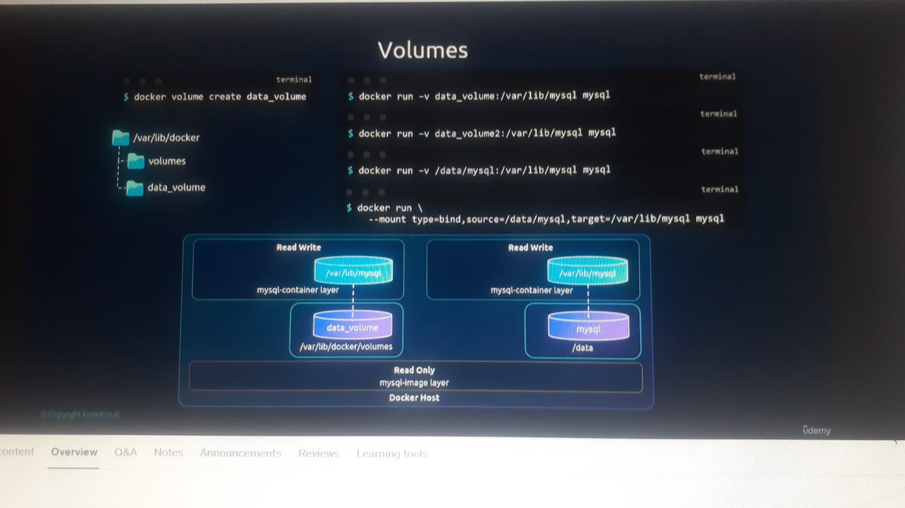
# The type in this case is bind.

**The source is the location on my host, and target is the location on my container.
**
So who is responsible for doing all of these operations?

# Maintaining the layered architecture, creating a writable layer, moving files across layers to enable copy and write, etc..

 # It's the storage drivers.

# So Docker uses storage drivers to enable layered architecture.
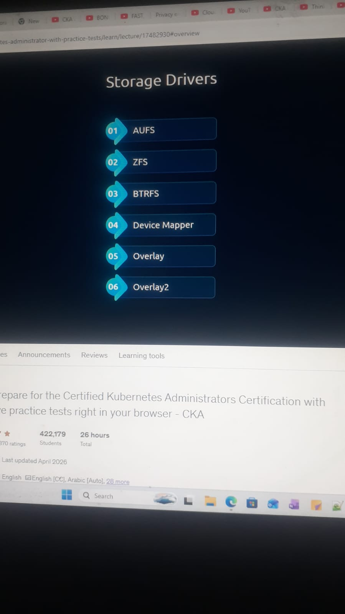

Some of the common storage drivers are UFS btrfs, DFS Device Mapper, Overlay and Overlay.

Two.

# The selection of the storage driver depends on the underlying OS being used.

# For example, with ubuntu, the default storage driver is UFS, whereas the storage driver is not available

on other operating systems like fedora or CentOS.

In that case, Device Mapper may be a better option.

# Docker will choose the best storage driver available automatically based on the operating system.

The different storage drivers also provide different performance and stability characteristics, so

you may want to choose one that fits the needs of your application and your organization.

If you would like to read more on any of these storage drivers, please refer to the links in the attached

documentation.

For now, that is all from the Docker architecture concepts.

See you in the next lecture.
------------------------------------------
# New Slide Storage Driver

Okay, so in the previous lecture we discussed about storage drivers.

# Storage drivers help manage storage on images and containers.

We also briefly touched upon volumes in the previous lecture.

# We learned that if you want to persist storage, you must create volumes.

# Remember that volumes are not handled by storage drivers.

# Volumes are handled by volume driver plugins.

# The default volume driver plugin is local.

# The local volume plugin helps create a volume on the Docker host and store its data under the var lib

docker volumes directory.

# There are many other volume driver plugins that allow you to create a volume on third party solutions
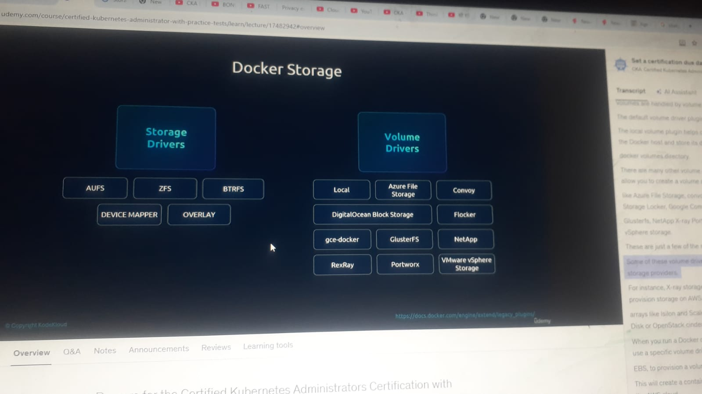

# like Azure File Storage, convoy, DigitalOcean, Block Storage Locker, Google Compute Persistent Disks, Glusterfs, NetApp X-ray Portworx, and VMware vSphere storage.

These are just a few of the many.

Some of these volume drivers support different storage providers.

# For instance, X-ray storage driver can be used to provision storage on AWS, EBS, S3, EMC storage

arrays like Isilon and Scaleio, or Google Persistent Disk or OpenStack cinder.

# When you run a Docker container, you can choose to use a specific volume driver, such as the X-ray EBS, to provision a volume from Amazon EBS.
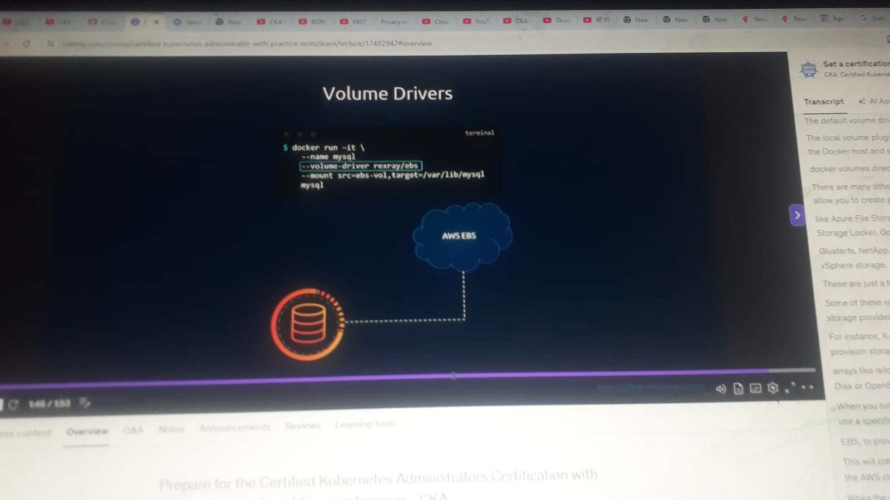

This will create a container and attach a volume from the AWS cloud.

When the container exits, your data is saved in the cloud.

In the upcoming lectures, we will see more about volumes in Kubernetes.

Play
Play

